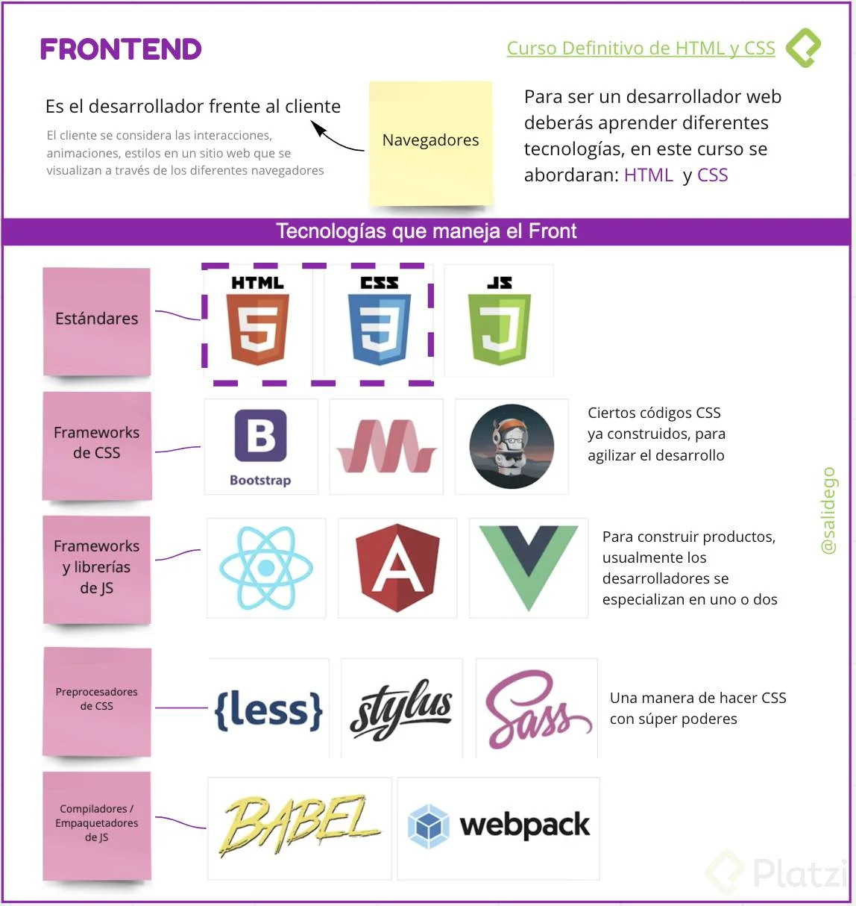
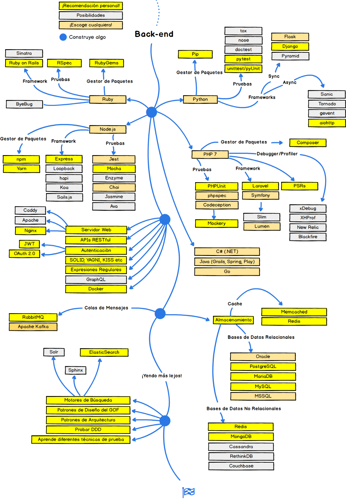
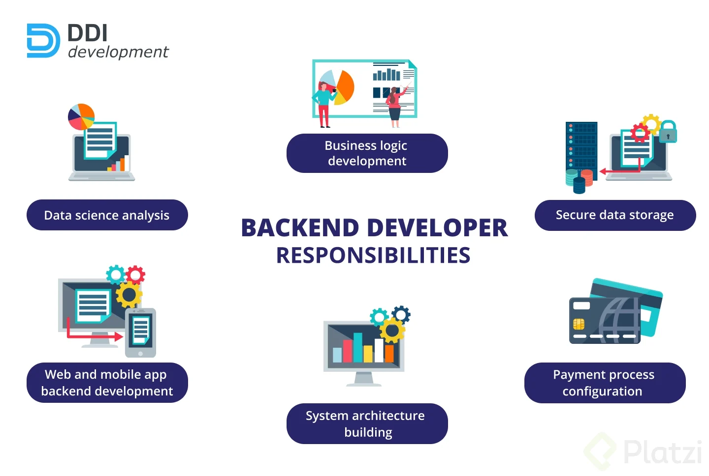
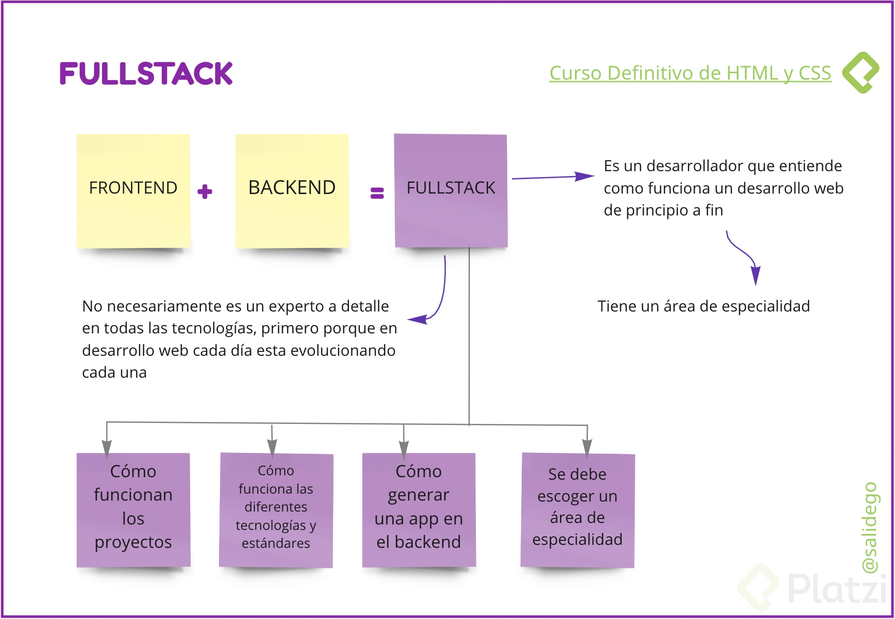
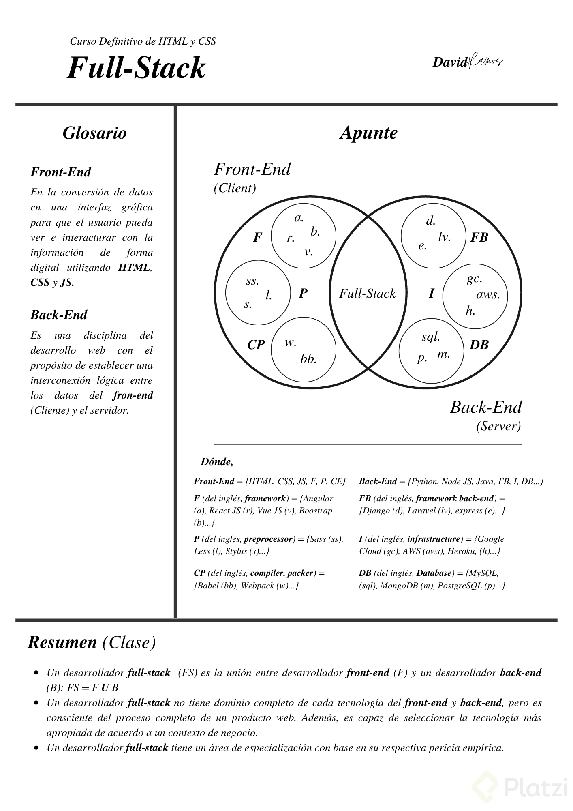
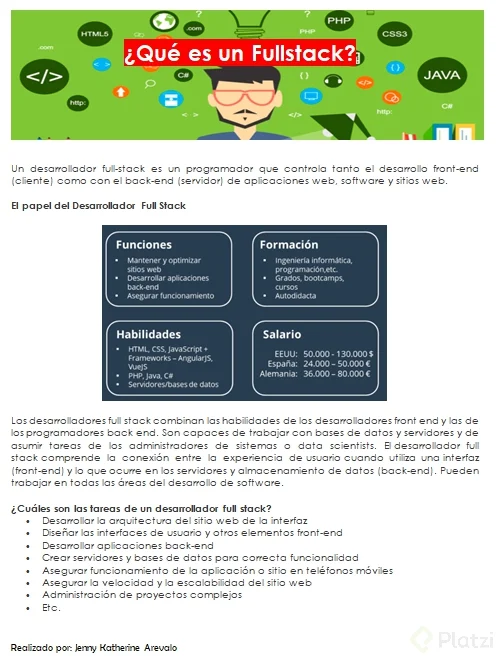
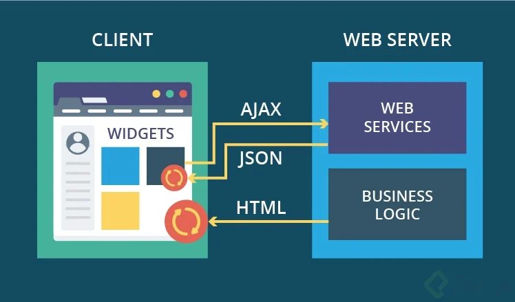
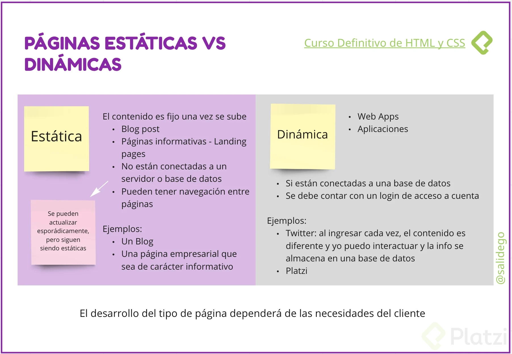

Además de los estándares, frameworks, preprocesadores y librerías que maneja un Frontend Developer, me gustaría compartir estas herramientas que nos permiten un mejor desarrollo.

***Herramientas***
* Mediaqueri: Algunas ideas sobre como deberíamos implementar el diseño responsive en nuestro sitio.
* Coolors: Paletas de colores.
* Unsplash: Imagenes gratis (Da los créditos a los fotógrafos 😉).
* FontPair: Ver cuales fuentes puedes combinar. Y obviamente Google Fonts para obtener esas fuentes.
* Icons8: Iconos, vectores, música y algunos recursos más…

***Documentaciones***
* CSS
* HTML
* Browserdiet: Optimizar sitios web (Perder peso en la web 😛). Recuerda que Platzi tiene también un curso de Web Performance
* WCAG: Guía para mejorar la accesibilidad de nuestro sitio. Recuerda que Platzi tiene el curso de accesibilidad web.

***Practica jugando***
* Grid Layout
* Flexbox

**Quien es el SERVIDOR?**   
Es quin da estructura a los datos de un sitio web para que sean almacenados y de esta manera puedan ser visualizados cuando el navegador lo demande.

**¿Qué significa la palabra DEPLOY?:**
Deploy es un término famoso entre los desarrolladores web. Puede significar muchas cosas, dependiendo del ambiente y de la tecnología usada. Sin embargo, los significados que más se refieren a la práctica y pueden resumir su función son: **implantar, colocar en posición, habilitar para uso o, simplemente, publicar.**   
Imagina que has creado un sitio web en tu computador, y lo has dejado estático sin publicar. En el momento en que incorporas tu página a un servidor de web hosting, este proceso será considerado un deploy.

**Que es el Backend Developer?**
* El back-end developer trabajar del lado del servidor, es decir, maneja toda la lógica al momento de que el navegador haga una petición (como buscar cierta página con el perfil del usuario) y devolver esa solicitud al navegador.   
* En el Backend, a diferencia del fronted, no existe un estándar, por lo tanto, maneja diferentes lenguajes de programación como node.js, Python, php, Go, Java, Ruby o .NET y por ende distintos frameworks que permiten realizar cosas de forma más rápida y robusta como Django (Python), Laravel (PHP), Rails (Ruby), Express (Node.js) y Spring (Java).
* A su vez, debe analizar donde va a subir o qué infraestructura de la nube va a utilizar, para decidir como conecta su base de dato en la nube con el fronted, dentro de estas existen Google Cloud, DigitalOcean, AWS y Heroku.
* Finalmente, debe manejar bases de datos y conectarla a su lenguaje de programación, dentro de ellas pueden existir relacionales (MySQL, PostgreSQL) o no relacionales (mongoDB).

Un Desarrollador Fullstack es alguien que tiene conocimientos tanto del Front-end como del Back-end, es alguien que entiende como funciona un producto web desde principio a fin. Desde la idea hasta la producción!
Sin dudas tiene un alto conocimiento acerca de una aplicación web.
Pero Hey! Ellos tienen sus áreas de especialización, ya sea Front-end o Back-end
Espero ver sus aportes relacionados a un Desarrollador Fullstack, es a mi parecer, un mundo bastante amplio!

[Paginas Estaticas vs. Dinamicas 1](img/Paginas_estaticas_dinamicas1.jpg "Paginas Estaticas vs. Dinamicas 1")

[Paginas Estaticas vs. Dinamicas 2](img/Paginas_estaticas_dinamicas2.jpg "Paginas Estaticas vs. Dinamicas 2")

