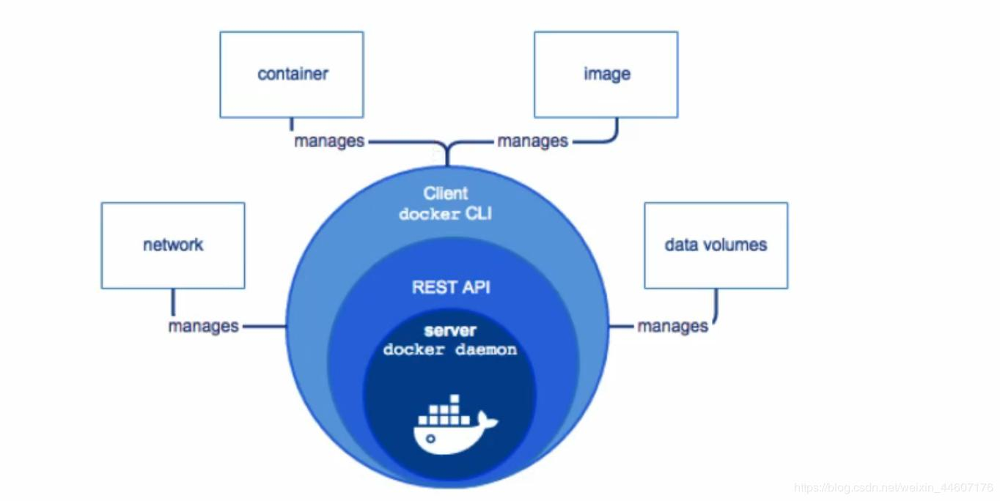
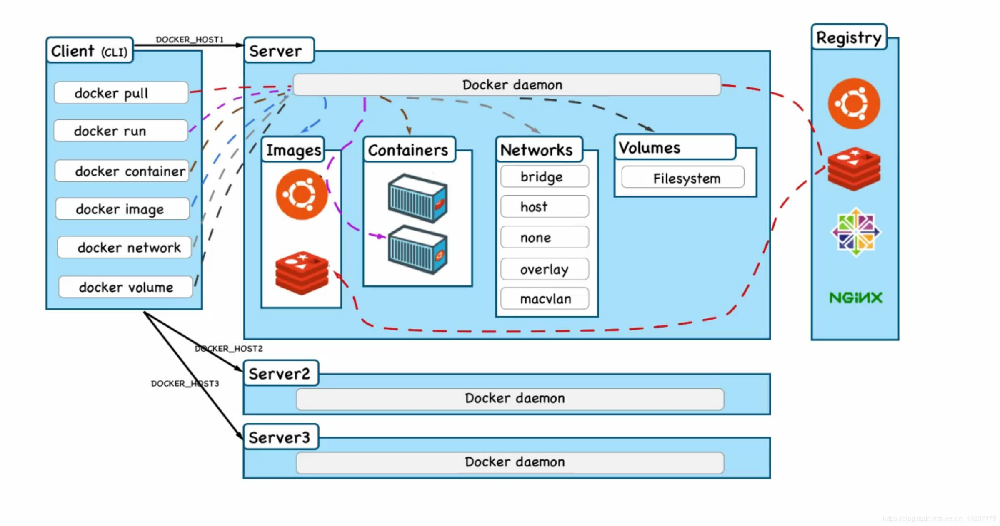
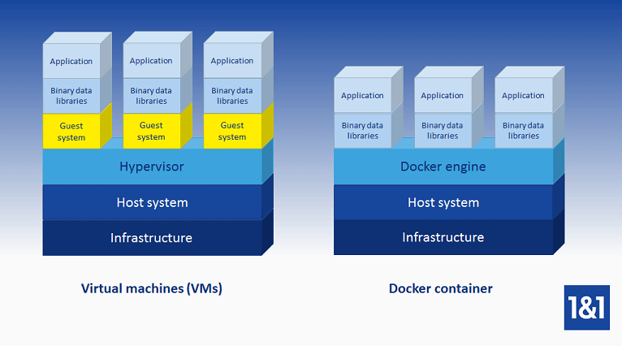
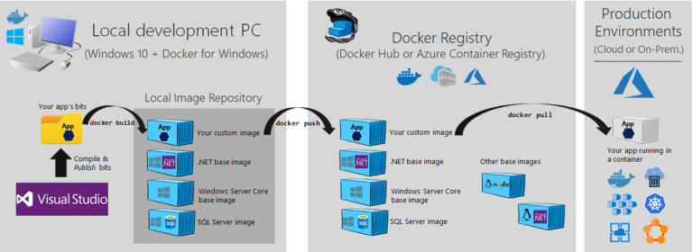
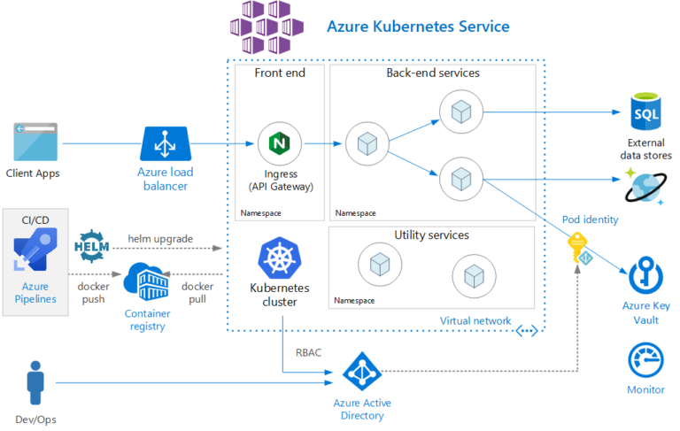
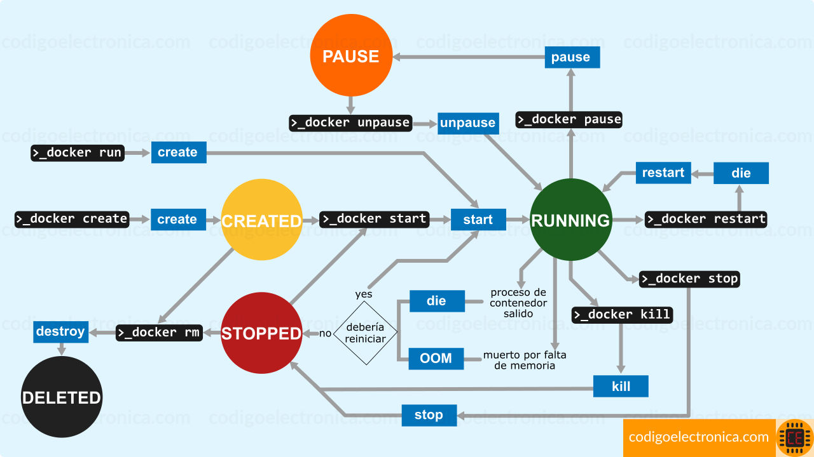
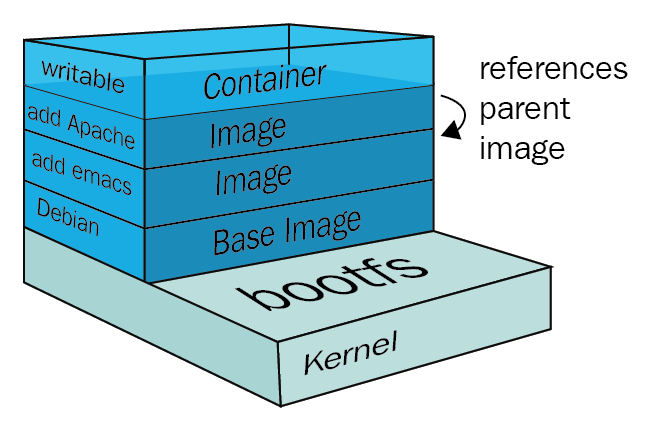

[Docker-Pagina Oficial](https://www.docker.com)

[Docker-Informacion](https://www.computerweekly.com/es/definicion/Docker)

[Repositorio-imagenes](https://hub.docker.com/)

# Fundamentos de Docker

## Informacion Rapida de Docker

### Estructura General
Introducción a Docker Engine (Docker Engine)
* Docker Engine es una aplicación cliente-servidor (C / S) que contiene los siguientes componentes
  * **Servidor:** un demonio de larga ejecución (Docker Daemon)
  * **REST API:** un conjunto de interfaces para comunicarse con Docker Daemon e indicarle que realice operaciones
  * **Cliente:** CLI (interfaz de línea de comando):

La CLI utiliza los comandos de Docker para controlar directamente el Docker Daemon para realizar operaciones a través de la API REST. El Docker Daemon es responsable de crear y administrar los objetos de Docker (imágenes, contenedores, redes, volúmenes de datos) como se muestra a continuación:




### Estructura subyacente de Docker
* Docker se implementa en el lenguaje Go.
* Docker usa varias características del kernel de Linux para implementar funciones:
  * Uso de espacios de nombres de Linux (espacios de nombres
  * Uso de grupos de control de Linux
  * Usando Linux Union File System (Union File Systems)   
  
  Esto también significa que Docker solo se puede ejecutar en un entorno Linux. Para ejecutar Docker en Windows y Mac, Docker utiliza tecnología de virtualización y se ejecuta en una máquina virtual Linux.



### Formato de Contenedor:
* Un paquete en el que Docker Engine combina espacios de nombres, Cgroups y UnionFS es un formato contenedor
* Docker implementa la creación y la gestión del ciclo de vida de los contenedores mediante la gestión de los espacios de nombres, los grupos C y UnionFS en este paquete. 
* Hay muchos formatos de contenedor, y el formato de contenedor utilizado por Docker se llama: libcontainer
* Una introducción detallada a estas tres características:
  * **Espacios de nombres (name espace):** Proporciona aislamiento a nivel del sistema operativo para contenedores Docker
    * **Aislamiento del número de proceso:** el primer proceso que se ejecuta en cada contenedor, el proceso siempre se cuenta desde 1
    * **Aislamiento de la red:** la red de contenedores está aislada y separada del host u otra red de contenedores, lo que equivale a dos redes
    * **Aislamiento entre procesos:** el proceso en el contenedor es complementario e invisible para el proceso en el host u otros contenedores, y la comunicación requiere la ayuda de la red
    * **Aislamiento de montaje del sistema de archivos:** el contenedor tiene su propio directorio de trabajo separado
    * **Aislamiento del número de versión del kernel y del sistema:** cuando el contenedor mira el número de versión del kernel o el número de versión del sistema, mira el contenedor, no el host
  * **Grupos de control (control group)**: proporcionan aislamiento a nivel de hardware para Docker
    * El grupo de control puede controlar los recursos de hardware utilizados por el bloqueo de la aplicación
    * En función de esta naturaleza, el grupo de control ayuda al motor de la plataforma acopladora a compartir recursos de hardware en el contenedor y a restringir y limitar, como el tamaño de memoria utilizado por el controlador, el número de núcleos de CPU, etc.
  * **Union File Systems (Union File System):** use la idea de capa (capas) para administrar imágenes y contenedores


### Que es docker?
Docker es una plataforma de software de código abierto para crear, implementar y administrar contenedores de aplicaciones virtualizados en un sistema operativo (SO) común, con un ecosistema de herramientas aliadas. La tecnología de contenedores Docker debutó en 2013; Docker Inc. se formó para respaldar una edición comercial de software de gestión de contenedores y ser el patrocinador principal de una versión de código abierto. Mirantis adquirió el negocio de Docker Enterprise en noviembre de 2019.

### Como funciona Docker?
Docker empaqueta, aprovisiona y ejecuta contenedores. La tecnología de contenedor está disponible a través del sistema operativo: un contenedor empaqueta el servicio o función de la aplicación con todas las bibliotecas, archivos de configuración, dependencias y otras partes y parámetros necesarios para operar. Cada contenedor comparte los servicios de un sistema operativo subyacente. Las imágenes de Docker contienen todas las dependencias necesarias para ejecutar código dentro de un contenedor, por lo que los contenedores que se mueven entre entornos de Docker con el mismo sistema operativo funcionan sin cambios.

***Docker utiliza el aislamiento de recursos en el kernel del sistema operativo para ejecutar varios contenedores en el mismo sistema operativo.*** Esto es diferente a las máquinas virtuales (VM), que encapsulan un sistema operativo completo con código ejecutable sobre una capa abstracta de recursos de hardware físico.

Docker se creó para funcionar en la plataforma Linux, pero se ha ampliado para ofrecer un mayor soporte para sistemas operativos que no son Linux, incluidos Microsoft Windows y Apple OS X. Hay disponibles versiones de Docker para Amazon Web Services (AWS) y Microsoft Azure.

### Componentes y Herramientas de Docker
***Docker Community Edition es de código abierto, mientras que Docker Enterprise Edition es una versión comercial ofrecida por Docker Inc.*** Docker consta de varios componentes y herramientas que ayudan a crear, verificar y administrar contenedores.

* **Docker Engine** es la tecnología subyacente que maneja las tareas y los flujos de trabajo involucrados en la creación de aplicaciones basadas en contenedores.
* El motor crea un proceso demonio del lado del servidor que **aloja imágenes, contenedores, redes y volúmenes de almacenamiento**. 
* El demonio también proporciona una **interfaz de línea de comandos (CLI)** del lado del cliente para que los usuarios interactúen con el demonio a través de la interfaz de programación de aplicaciones de Docker. 
Los contenedores creados por Docker se denominan Dockerfiles.
* Los archivos de **Docker Compose** definen la composición de los componentes en un contenedor de Docker.
* **Docker Hub** es una herramienta de software como servicio que permite a los usuarios publicar y compartir aplicaciones basadas en contenedores a través de una biblioteca común. El servicio promociona más de 100.000 aplicaciones disponibles públicamente, así como registros de contenedores públicos y privados.
* Al igual que Hub, **Trusted Registry** es un repositorio con una capa adicional de control y propiedad sobre el almacenamiento y la distribución de imágenes de contenedores.
* **El modo de enjambre de Docker en Docker Engine admite el equilibrio de carga del clúster para Docker**. Varios recursos de host de Docker se agrupan para actuar como uno solo, lo que permite a los usuarios escalar rápidamente las implementaciones de contenedores a múltiples hosts.
* **Universal Control Plane** es una interfaz de administración de aplicaciones y clúster unificada basada en la web.
* **Compose** es una herramienta para configurar servicios de aplicaciones de contenedores múltiples, ver los estados de los contenedores, transmitir la salida del registro y ejecutar procesos de instancia única.
* **Content Trust** es una herramienta de seguridad para verificar la integridad de los registros de Docker remotos, a través de firmas de usuario y etiquetas de imagen.

### Versiones de Docker y características principales
* **Docker Enterprise 1.13**, lanzado en enero de 2017, agregó compatibilidad con versiones anteriores para la interfaz de línea de comandos (CLI) para manejar demonios Docker más antiguos, y varios comandos de limpieza para administrar de manera más eficiente el espacio en disco y los datos, así como algunas correcciones de seguridad y errores.   
* Otras mejoras de **Docker Enterprise en 2017** incluyeron soporte nativo de Kubernetes para la orquestación de contenedores, además del modo enjambre de Docker; y soporte para mainframe IBM y Windows Server 2016, para que los usuarios ejecuten aplicaciones y clústeres mixtos en múltiples sistemas operativos.
* **Docker Enterprise Edition 2.0**, lanzado en abril de 2018, incluía soporte para múltiples sistemas operativos y múltiples nubes para entornos híbridos.
* **Docker Enterprise 3.0**, la versión más reciente de julio de 2019, agregó actualizaciones de clústeres de contenedores azul-verde y la capacidad de crear aplicaciones multiservicio basadas en contenedores que se ejecutan desde cualquier entorno. Otras características nuevas incluyen:
  * **Docker Desktop Enterprise,** que permite a los desarrolladores implementar aplicaciones en un entorno compatible con Kubernetes con integración de canalización automatizada y administración de TI centralizada;
  * **Docker Applications,** un conjunto de herramientas de productividad para desarrolladores;
  * **Docker Kubernetes Service,** que automatiza la gestión y la escala de aplicaciones basadas en Kubernetes y proporciona seguridad, control de acceso y gestión automatizada del ciclo de vida; y
  * **Docker Enterprise as a Service,** un servicio de contenedores empresarial totalmente gestionado.

### Ventajas y desventajas de Docker
* Docker **surgió como una plataforma estándar de facto para componer, crear, implementar, escalar y supervisar contenedores** rápidamente en los hosts de Docker. 
* Docker **permite un alto grado de portabilidad** para que los usuarios puedan registrar y compartir contenedores en varios hosts en entornos públicos y privados. 
* Los beneficios de Docker **incluyen un desarrollo de aplicaciones eficiente, un menor uso de recursos y una implementación más rápida** en comparación con las máquinas virtuales.
También existen desafíos potenciales con Docker. 
* **La gran cantidad de contenedores posibles en una empresa puede resultar difícil de administrar** de manera eficiente.  
* A medida que el uso de contenedores evoluciona desde el alojamiento virtual granular hasta la orquestación de los componentes y recursos de la aplicación, **la distribución e interconexión de aplicaciones en componentes —que pueden involucrar cientos de contenedores efímeros— es un obstáculo importante.**
* En los últimos años, **Docker fue reemplazado por Kubernetes para la orquestación de contenedores**; sin embargo, la mayoría de las ofertas de Kubernetes ejecutan Docker en segundo plano.



### Seguridad de Docker

* Un problema históricamente persistente con los contenedores —y Docker, por extensión sinónima— es la seguridad. A pesar del excelente aislamiento lógico, los contenedores aún comparten el sistema operativo del host. 
* **Un ataque o falla en el sistema operativo subyacente puede potencialmente comprometer todos los contenedores que se ejecutan encima del sistema operativo.** 
* Las vulnerabilidades pueden involucrar acceso y autorización, imágenes de contenedores y tráfico de red entre contenedores. 
* Las imágenes de Docker pueden conservar el acceso de root al host de forma predeterminada, aunque esto a menudo se transfiere desde paquetes de proveedores externos.
* Docker ha agregado regularmente mejoras de seguridad a la plataforma Docker, como: 
  * escaneo de imágenes, 
  * introducción segura de nodos, 
  * identidad de nodos criptográficos, 
  * segmentación de clústeres y 
  * distribución segura de secretos. 
* La gestión de secretos de Docker también existe en Kubernetes, así como en D2iQ, CISOfy Lynis y HashiCorp Vault. Varias herramientas de escaneo de seguridad de contenedores han surgido de Aqua, Twistlock, NeuVector y otros.
* Algunas organizaciones ejecutan contenedores dentro de una máquina virtual, aunque los contenedores no requieren máquinas virtuales —esto no resuelve el vector de problemas de recursos compartidos, pero mitiga el impacto potencial de una falla de seguridad. 
* Otra alternativa es utilizar VM de perfil bajo o "micro", que no requieren la misma sobrecarga que una VM típica; los ejemplos incluyen gVisor, Kata Containers y Amazon Firecracker. Sobre todo, el paso más común y recomendado para garantizar la seguridad del contenedor es no exponer los hosts del contenedor a internet y solo usar imágenes de contenedor de fuentes conocidas.
* La seguridad también fue el principal punto de venta para las alternativas de Docker, particularmente el rkt de CoreOS. Sin embargo, Docker ha hecho muchos avances para mejorar sus opciones de seguridad, mientras que al mismo tiempo el impulso de esas alternativas de contenedores se ha desvanecido.

### Alternativas, ecosistema y estandarización de Docker
* Existen herramientas de terceros que funcionan con Docker para tareas como la administración de contenedores y la agrupación en clústeres. 
* El ecosistema de Docker incluye una combinación de tecnologías patentadas y de código abierto, como Kubernetes de código abierto, el empaquetado OpenShift patentado de Red Hat de Kubernetes y la distribución de Kubernetes de Canonical denominada Kubernetes "pura" en sentido ascendente. Docker compite con contenedores de aplicaciones patentados como VMware vApp y herramientas de abstracción de infraestructura, incluido Chef.
* Docker no es la única plataforma de contenedores disponible, pero posee la gran mayoría del mercado de contenedores. 
* CoreOS rkt, pronunciado cohete, se destaca por su seguridad con soporte para SELinux y administración de plataforma confiable. 
* Red Hat (ahora propiedad de IBM) compró CoreOS e integró su funcionalidad en su arquitectura OpenShift. Sin embargo, rkt es ahora un proyecto archivado en Cloud Native Computing Foundation.
* Otras plataformas de contenedores importantes incluyen LXD, que es de Canonical (y su versión de Ubuntu Linux), y OpenVZ, la más antigua de las plataformas de contenedores del sistema, desarrollada originalmente por Virtuozzo. 
* OpenVZ combina el tamaño pequeño y la alta velocidad de los contenedores estándar con la seguridad adicional de una capa de sistema operativo abstraída.
* Docker también desempeñó un papel de liderazgo en una iniciativa para estandarizar más formalmente el empaquetado y la distribución de contenedores: 
  * la Open Container Initiative, establecida para fomentar un formato de contenedor común y un entorno de ejecución. 
  * Otros miembros incluyen más de 40 proveedores de la industria de contenedores, incluidos CoreOS, AWS, Intel, Red Hat y Virtuozzo.
* Finalmente, Windows Server 2019 y Windows 10 ofrecen soporte directo para contenedores que utilizan la función de contenedor de Windows basada en la tecnología Docker.

### Historia de la empresa Docker

* Docker se lanzó por primera vez como plataforma de código abierto en marzo de 2013, con el nombre de dotCloud. 
* Docker Engine 1.0 se lanzó en 2014. 
* En 2016, Docker integró su orquestación de enjambre con Docker Engine en la versión 1.12. 
* El objetivo más amplio de Docker era desarrollar su negocio con contenedores como servicio, pero finalmente estos planes fueron superados por el surgimiento de Kubernetes.
* Docker Enterprise se introdujo en marzo de 2017 y la empresa también donó su utilidad de tiempo de ejecución de contenedores en contenedor a la Cloud Native Computing Foundation.
* En noviembre de 2019, Mirantis adquirió productos de Docker e IP en torno a Docker Engine - Enterprise, Docker Trusted Registry, Docker Universal Control Plane y Docker CLI, así como el producto comercial Docker Swarm. 
* Mirantis inicialmente indicó que cambiaría su enfoque a Kubernetes y eventualmente finalizaría el soporte para Docker Swarm, pero luego reafirmó su intención de brindar soporte y desarrollar nuevas funciones para él. 
* La empresa restante de Docker Inc. ahora se centra en Docker Desktop, así como en Docker Hub.








Comandos:

Caso 1. 
* **Primero Clone un Repositorio.** El proyecto Getting Started es un repositorio simple de GitHub que contiene todo lo que necesita para crear una imagen y ejecutarla como contenedor.
```
docker run --name repo alpine/git clone https://github.com/docker/getting-started.git

docker cp repo:/git/getting-started/ .
```
* **Ahora, construya una imagen.** Una imagen de Docker es un sistema de archivos privado solo para su contenedor. Proporciona todos los archivos y el código que necesita su contenedor.
```
cd getting-started

docker build -t docker101tutorial
```
* **Ejecute su primer Container.** Inicie un contenedor basado en la imagen que creó en el paso anterior. La ejecución de un contenedor inicia su aplicación con recursos privados, aislados de forma segura del resto de su máquina.
```
docker run -d -p 80:80 --name docker-tutorial docker101tutorial
```
* **Ahora grabe y comparta su image.** Guarde y comparta su imagen en Docker Hub para permitir que otros usuarios descarguen y ejecuten fácilmente la imagen en cualquier máquina de destino.
```
docker tag docker101tutorial pzunigada/docker101tutorial

docker push pzunigada/docker101tutorial
```

## Informacion del curso

### ***Profundizando en el concepto de imágen***
***¿Qué son las imágenes?***   
Son moldes o plantillas que tienen empaquetado todo lo necesario para funcionar. Docker usa estás misma para construir contenedores.  

***¿Para qué sirven las imágenes en la construcción de software?***   
Las imágenes sirven para crear contenedores y también es como docker intenta solucionar el problema de construcción de y distribución de software.

Es bueno profundizar un poco más en el concepto de una imágen en Docker para entender su función, para posteriormente poder realizar una por nuestra cuenta desde 0, cuando no haya una imágenque cumpla con nuestras necesidades.

***Imágen***   
* Una imágen contiene distintas capas de datos (distribución, diferente software, librerías y personalización).
* Podemos llegar a la conclusión, que una imágen se conforma de distintas capas de personalización, en base a una capa inicial (base image), la dicha capa, es el más puro estado del SO.
* La siguiente ilustración nos mostraría la representación gráfica, del concepto de una imágen en Docker.



Si observamos, partimos desde la base del SO, y vamos agregando capas de personalización hasta obtener la imágen que necesitamos:

* distribución debian
* se agrega el editor emacs
* se agrega el servidor Apache
* se agregan los permisos de escritura para la carpeta /var/www de Apache

* Hay que tener en cuenta, que todo parte del Kernel de Linux, en caso de utilizar alguna distrubución de Linux

***Historico de una imágen*** 

Observar la lista de imagenes existentes
```shell
docker image ls
```
**TAG:** Es la version de la imagen, cuando no especificamos que versión de descargar docker asume que es la última
**CREATE AT:** Tiempo de creación
**SIZE:** Tamaño de la imagen
**IMAGE ID:** Este es el identificador de la imagen. Si descargamos dos imágenes que son iguales al realizar un pull, docker lo que hará es tener un puntero lógico a la misma imagen ya descargada y no descargará la otra imagen. Existe la posibilidad que tenga TAG diferentes, pero serán la misma imagen. Esto último se puede comprobar viendo el IMAGE ID, debería ser los mismos.

descargar imagen de la ultima version desde dockerhub
```shell
docker pull <image_name>
```
descargar imagen con una version especifica desde dockerhub
```shell
docker pull <image_name>:<tag_name>
```
Podemos observar la historia de nuestra imágen, con el siguiente comando
```shell
docker history [imagen]
```
Eliminar imagenes
```shell
docker image prune -a
```
De esta manera podemos ver las capas de personalización que fuerón agregadas, para la construcción de la imágen que conocemos.