## CLASE 1. 

***El objetivo del diseño es facilitar una comunicación efectiva.***

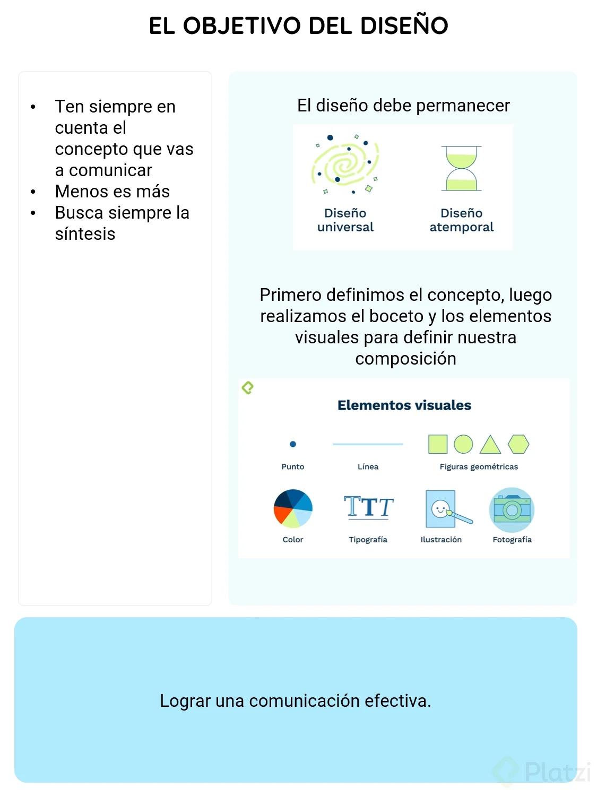

***¿Qué quiero comunicar?***   
**Diseño universal**   
Dirige sus acciones al desarrollo de productos y entornos de fácil acceso para el mayor número de personas posible, sin la necesidad de adaptarlos o rediseñarlos de una forma especial.

**Diseño atemporal**  
Es aquel diseño que perdura en el tiempo, desde mi punto de vista es importante porque te ayuda a mantener una marca, o dar a conocer algo con el paso de los años sin perder la identidad.

***¿Qué debemos de definir luego de tener el concepto?***
* Bocetos
* Definir composición

***¿Cuáles son elementos visuales?***
* Punto
* Línea
* Figuras geométricas
* Color
* Tipografía
* Ilustración

> Contribución creada por: Giuseppe Ramírez y Daniel N. Pozo

## **CLASE 2. - Comunicacion Efectiva en el Dise;o?**

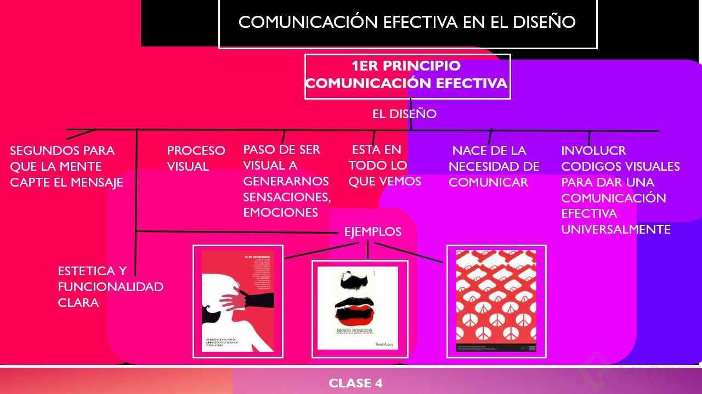 

***¿Cuál es la relación entre el diseño y la comunicación?***   
* El diseño nace por la necesidad de informar. 
* Es una herramienta de comunicación para la sociedad en cualquier área. 
* Aunque el diseño es muy amplio, en particular el diseño gráfico presenta conceptos y fundamentos que son de utilidad para comenzar a educar nuestro ojo. 
* El diseño gráfico ayuda a que la comunicación de un mensaje se presente de manera efectiva y precisa.

Veamos el siguiente ejemplo:
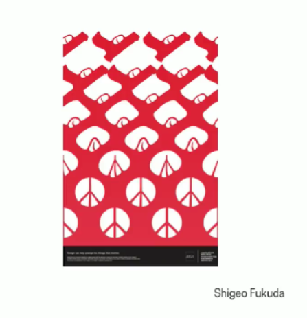

***¿Qué debemos considerar en la relación del diseño y la comunicación?***   
* El diseño debe cumplir con criterios para que se lleve a cabo una comunicación efectiva. Por ejemplo, en un póster se debe considerar su ubicación, el tiempo que la gente tendrá para ver ese póster o los códigos que se usarán para presentar una comunicación precisa.   
* El mensaje de un diseño puede ser universal: es decir, un significado unívoco que no dependa de un contexto cultural determinado
* La percepción visual es la relación que hacemos de lo que se está comunicando y la forma en la que lo vemos.
* El diseño tiene que tomar los códigos visuales para poder comunicar cosas que para la gente sea preciso y pueda relacionarlo con su entorno.
* El diseño está en todo lo que vemos.
* El diseño pasó de ser visual a generarnos sensaciones, nos cambia la manera en la que percibimos ciertos entornos.
* El diseño es entender que la funcionalidad y la estética debe de tener un fin muy claro.

> Contribución creada por: Giuseppe Ramírez y César Daniel González

### ***COMUNICACIÓN EFECTIVA EN EL DISEÑO***

* ¿Que hace el diseño?
* ¿Cuándo comunica y como lo hace?
* ¿Cómo mantenemos una comunicación efectiva?

Todas estas preguntas son respondidas, en los siguientes párrafos.

Ejemplos:

**Posters,** su comunicación es de segundos por su ubicación (la gente viene y va), debe de ser lo más precisa posible.

**Poster, Shigeo Fukuda** - Armas que se convierten en simbolos de paz (una trancisión muy efectiva porque comunica algo que se entiende, las 2 imagenes principales son universales, todos lo entienden.)

**Poster, René Azcuy** - Besos Robados, comunica la intención conceptual, con apoyo del titulo y los actores visuales.

**Diseño gráfico**, aquí se debe de tomar un tiempo para procesar la imagen visual y mental para poder comprender lo que se ve.

***RECUERDA:*** Al diseñar debes de crear un vinculo, entre la necesidad y la informarción que se quiere dar a conocer.

***IMPORTANTE:*** El diseño está en todos nuestras áreas, en todo lo que vemos (en tu casa, en las formas, en los colores, en las estructuras, etc)

Ejem:
En la moda es un código de comunicación, manifestación directa del diseño.

En la arquitectura, es algo más visual que genera sensaciones, emociones, una percepción en los entornos y lugares distinta a lo que se conoce.

En el pop (disco de la banda Blur parklife), trasmite a traves de la estética y funcionalidad una comunicación clara.

**CONCLUSIÓN:** Encontramos o comunicamos una forma de diseño en nuestro día a día.

## **CLASE 3 - Que es el Contraste?**  

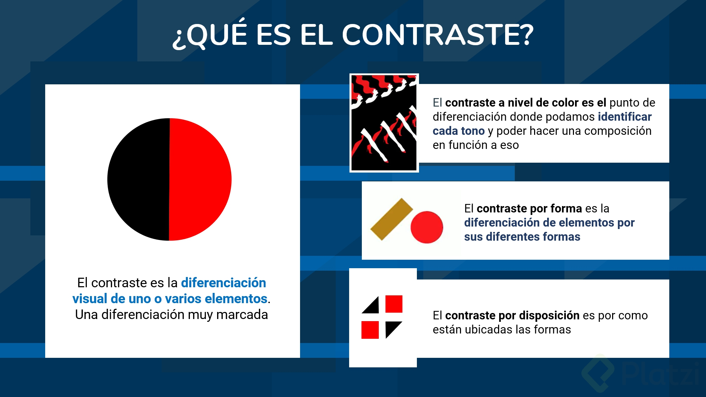

***¿Qué es el contraste?***   
El contraste en diseño es la diferencia de intensidad, tono o color entre dos o más elementos diferentes. Por ejemplo, si tiene un texto dorado brillante sobre un fondo negro, se ha utilizado el contraste para hacer que el mensaje destaque. El contraste puede usarse para conseguir generar jerarquía visual. Esto es cuando el espectador se fija en los elementos más importantes del diseño en primer o último lugar debido a su color y posición.

El contraste también puede emplearse para crear armonía entre dos elementos diferentes que contrastan entre sí. Por ejemplo, si tenemos un texto rosa brillante sobre un fondo rosa claro, se produce una armonía entre estos dos colores en lugar de un contraste porque ambos son tonos claros. El contraste es una parte fundamental del diseño porque hace que un elemento destaque sobre otro y ayuda a guiar lo que debe ser notado primero.

***¿Cuál es la diferencia entre forma y contraste?***   
Cuando se inicia en diseño, se suele confundir la percepción entre forma y contraste. Aunque no son lo mismo, tienen muchas similitudes.

La forma es el modo en que la forma, el tamaño, la posición y el color se combinan para crear un objeto. El contraste es la diferencia entre dos o más objetos. Cuanta más diferencia haya entre dos o más objetos, mayor será el contraste.

***Tipos de contraste que existen:***  
* El contraste a nivel de color: es encontrar uno de esos puntos de diferenciación y se pueda hacer una composición en función de eso.
  * Se trata de encontrar un punto de diferenciación donde logremos identificar cada tono y realizar una composición en función a esto.
  * Si escogemos una buena paleta de color, con colores bien diferenciados, podemos obtener un mensaje mucho más contundente.
  * Hay menos información por procesar.
* El contraste por forma: es diferenciar la forma de los elementos para lograr que por su disparidad se logre un mayor contraste.
  * Funciona bien al momento de digerir las imágenes de mejor manera.
  * Ya tenemos un conocimiento sobre cómo son las formas de ciertos elementos.
* El contraste por disposición: cómo será la interacción con el contenido por la disposición de las formas en el mismo.
  * ¿Cómo están ubicados los elementos?
  * ¿Cómo interactúan las formas entre sí?

> Contribución creada por: Giuseppe Ramírez.

***Hay 7 formas de contrastar los colores:***

1. **Contraste de color puro:** Se colocan colores saturados cuyo contraste aumenta mientras más alejados estén dentro del circulo cromático.
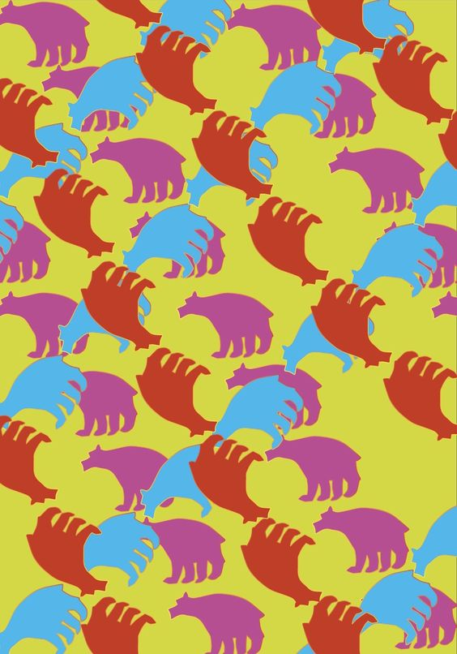

2. **Contraste de claro a oscuro:** Aquí se yuxtaponen colores de valores claros y oscuros cuyo contraste es más importante cuanto mayor sea la diferencia de luz.
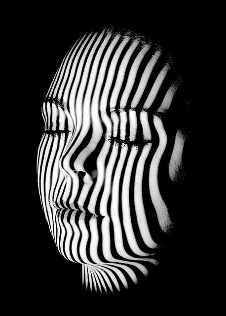

3. **Contraste de temperatura:** La interacción hace que un color cálido que esté rodeado de colores fríos se perciba como tal más cálido, mientras que cuando esté rodeado por colores cálidos se va a percibir como más frío. De la misma manera que si un color frío se rodea de colores cálidos se percibirá como más frío y si se rodea de otros colores fríos se percibirá como más cálido.
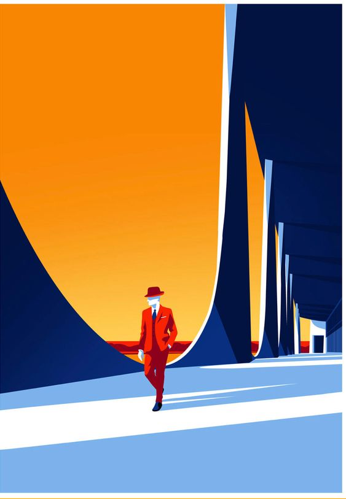

4. **Contraste de colores complementarios:** En este contraste están yuxtapuestos dos colores opuestos en el círculo cromático. Si estos colores están saturados el contraste será máximo.
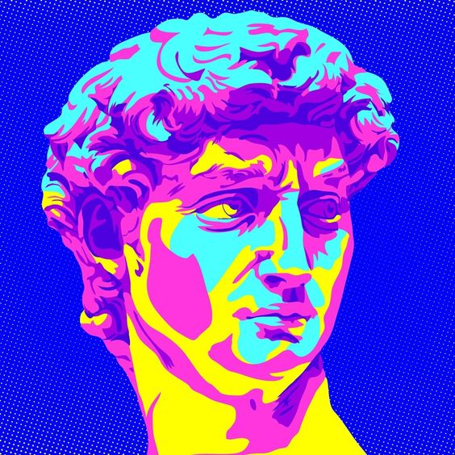

5. **Contraste de saturación:** Se la llama también contraste de calidad y es donde se yuxtaponen los colores vivos y los apagados. El contraste también va a depender de la disparidad en la intensidad cromática de los colores que interactúan lo que será mayor cuando se combine un tono puro con uno que no tenga croma.
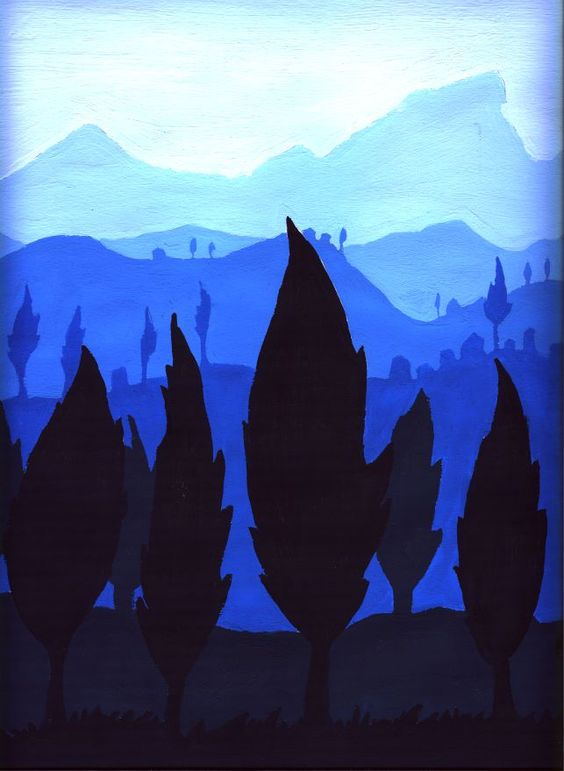

6. **Contraste de cantidad:** Este contraste es en el que se pueden ver la yuxtaposición de proporciones descompensadas de varios colores, donde hay mucho de uno y poco de otro. El recurso puede emplearse para la creación de efectos visuales o armonizar otros contrastes de gran intensidad, caso del contraste de complementarios.
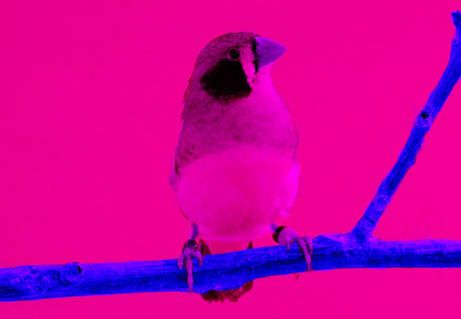

7. **Contraste simultaneo:** Este contraste, es un proceso fisiológico donde el órgano de la vista lo que hace es buscar el equilibrio según un color dado y hace que se produzca su opuesto en tono, valor, saturación o temperatura, lo que hace que se modifique la percepción de dicho color. Podríamos decir que es el contraste más sutil y complicado de identificar.
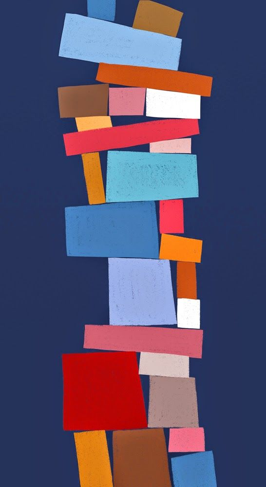

**Ejemplos de Contraste**    

Ser o no ser. es un dilema de cualquier ser.
Es contraste en sus formas y colores nos ayuda a distinguir claramente asi como marcar definidamente elementos en nuestro dise;o.

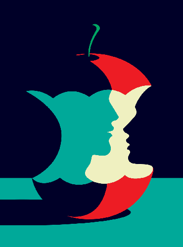

Contraste por Posicion   
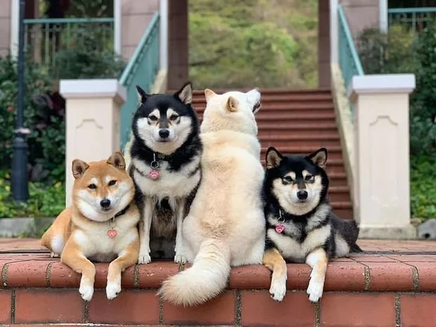

Contraste por Tama;o   

Contraste por Figura   
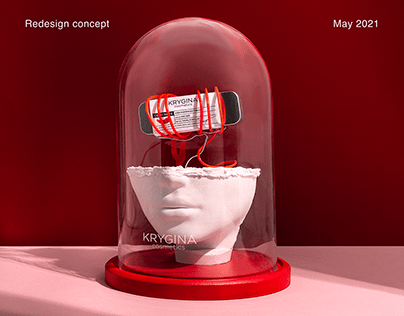

Otros Ejemplos de contraste

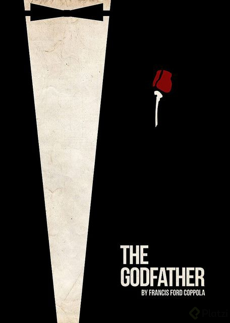

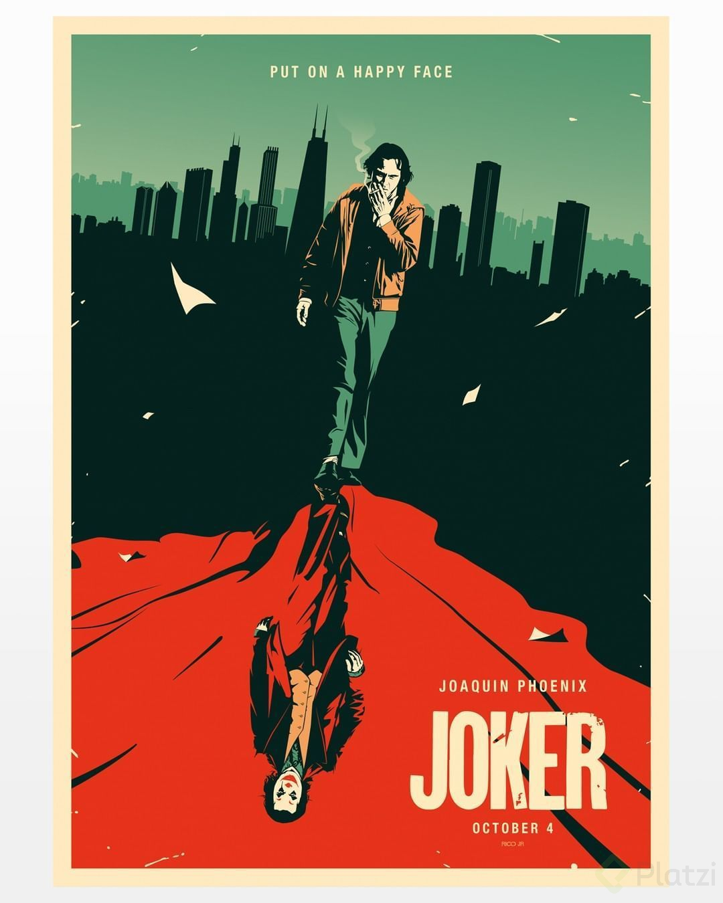

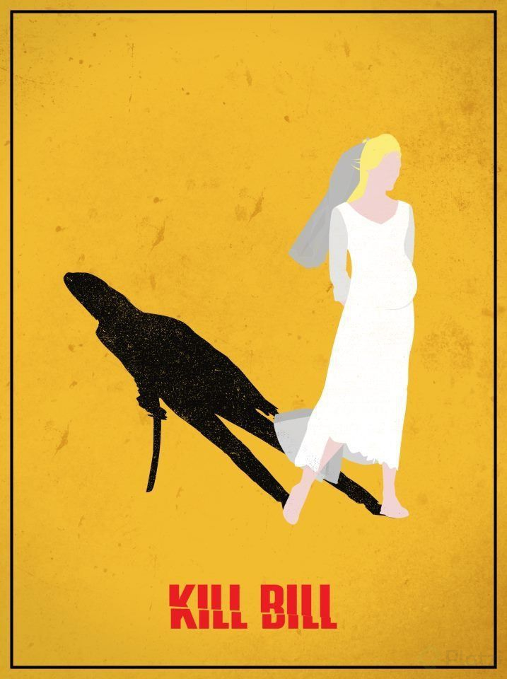

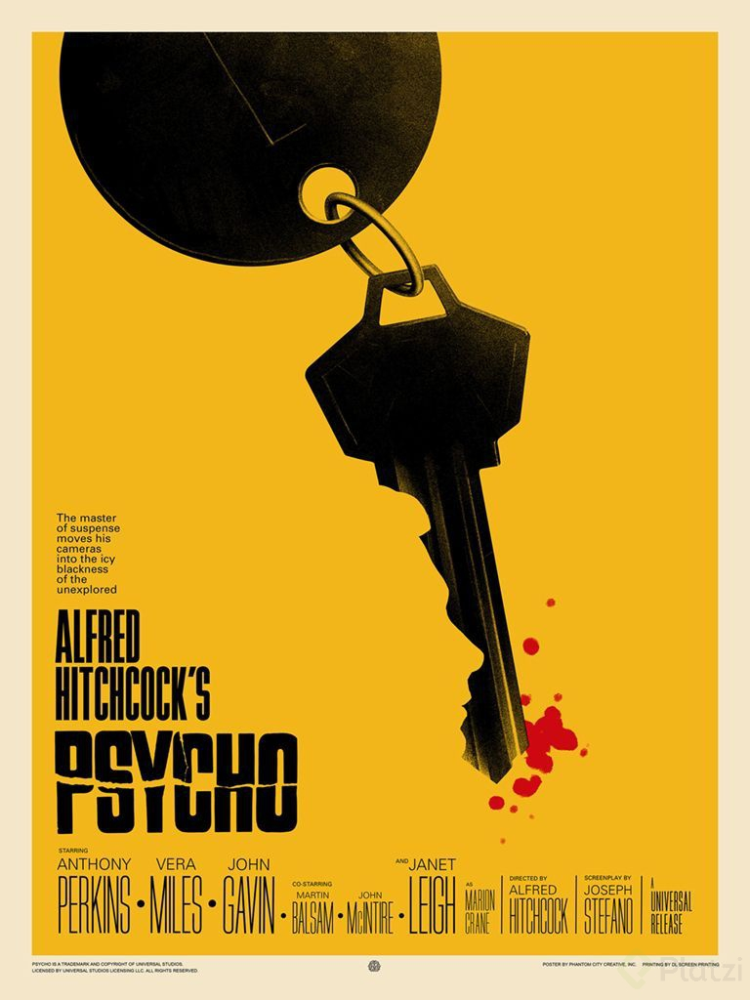

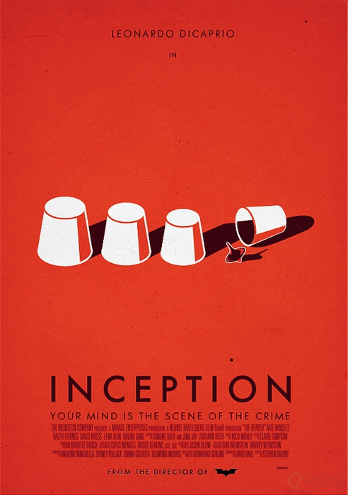

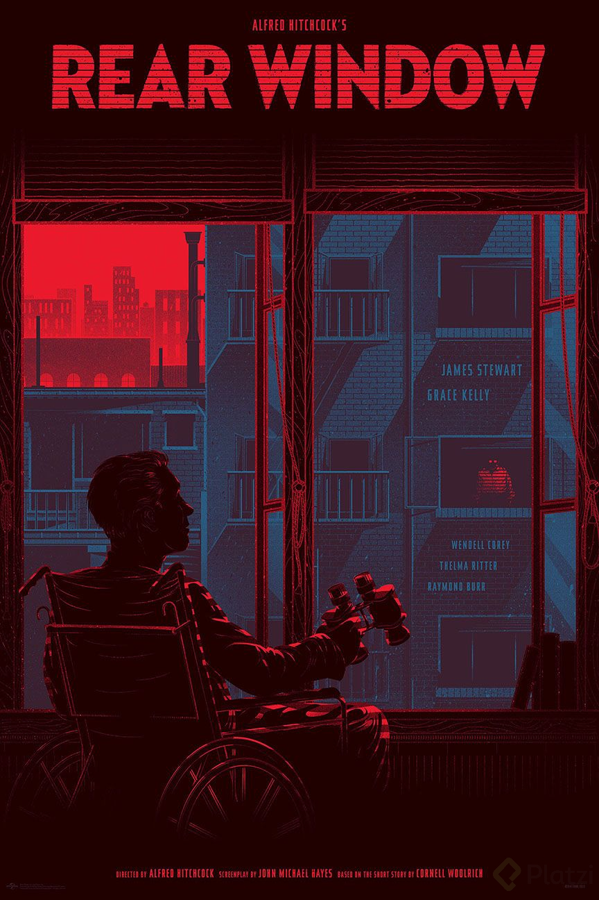

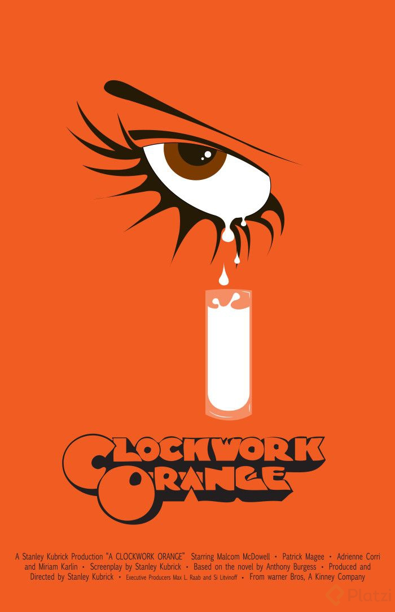

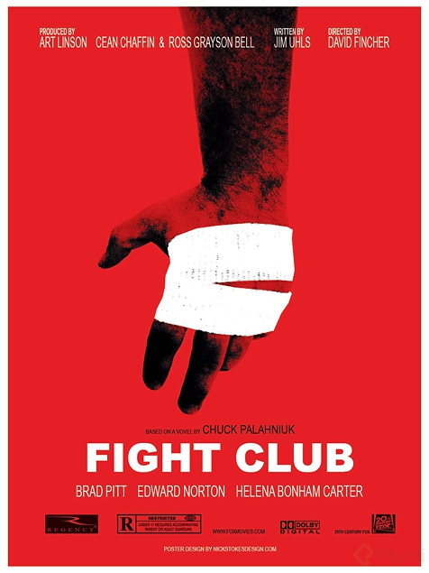

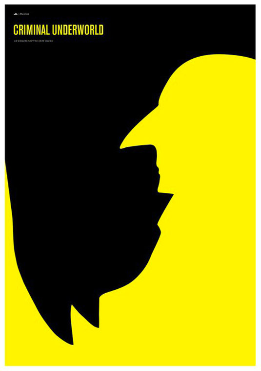

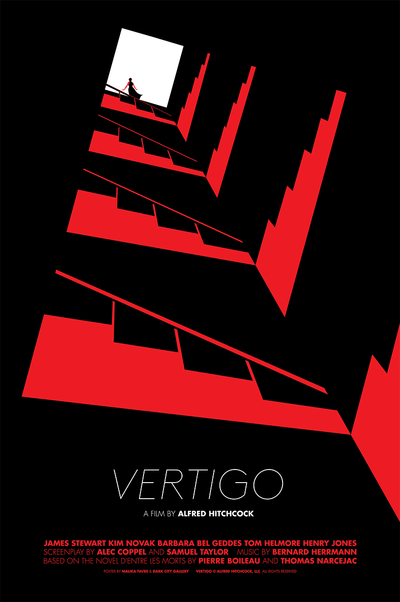

## **Clase 4 - Que es el concepto**
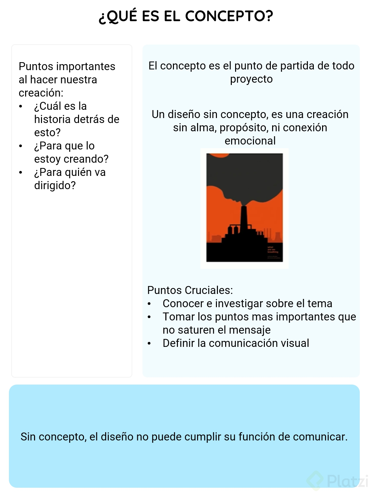

El concepto es el punto de partida para todo proyecto. Es la historia que contará el diseño.
Además, se puede definir al concepto como la representación tangible de una idea, sin concepto, el diseño no puede cumplir su misión de comunicar. También es conocido como brief

Sin concepto el diseño podría perder funcionalidad y limitarse a lo estético.

**¿Cómo crear la narrativa del diseño?**
* Conocer e investigar el tema
* Tomar los puntos más importantes
* Definir la comunicación visual

> Contribución creada por: Giuseppe Ramírez.

***Preguntas a responder para generar un concepto:***

* Cuál es el concepto?
* Cuál es la historia detrás?
* Porque se está creando?
* Para quien va dirigido?
* Cuáles son los puntos más importantes?
* Como voy a representar estos puntos importantes visualmente?

Algunos ejemplos de esta clase recuerda el primer capítulo de la serie Abstract en Netflix, sobre el ilustrador Cristhoph Niemann, donde se muestra un poco su proceso creativo detrás de algunas portadas de la revista The New Yorker y su juego con la abstracción. Por si no la han visto, les dejo el link de la serie que en todos sus capítulos nos da muchas ideas sobre el diseño aplicado incluso a automóviles y escenarios…   
[Serie Abstract - Netflix](www.netflix.com/title/80057883?source=android)

**Ejemplo de analisis de concepto:**

**¿Cuál es el concepto? / ¿Cuál es la historia detrás de esto?**   
Torrecé, fue una banda de rock fusión que creé a los 15 años con amigos de la residencia en la que crecí. Le colocamos ese nombre porque la mayoría de los integrantes vivíamos allí. Con la separación de la banda tras mi exilio, pensé que además de mi rol como autor, compositor e intérprete; también me gustaba crear y gestionar contenidos para redes sociales, planear la promoción de nueva música, redactar textos, etc. Así que, opté por agrupar todo en una marca personal que reflejara mi estilo de vida, carrera artística musical y trabajo profesional en marketing digital bajo el nombre de Manuel Torrecé.

***¿Por qué lo estoy creando o por qué se creó?***   
Quiero compartir mi música, vida y lo que me gusta: actividades, nuevos lugares, personas y experiencias.
Las marcas personales sirven como portafolio para conseguir trabajo y/o una cartera de clientes.
Para destacar/resaltar por encima del promedio.

***¿Para quién va dirigido?***   
A estudiantes universitarios solteros, entre 18 a 24 años que quieren avanzar en su carrera, disfrutar con amigos, conocer personas, sitios y viajar.  
A marcas/empresas que quieran promocionar sus productos o servicios mediante mi contenido.  
A personas que busquen contratar un servicio de creación y gestión de contenido para rrss.  
A personas aficionadas al marketing digital que quieran conocer y/o aprender del tema.

***¿Cuáles son los puntos más importantes?***  
Arte, marketing y entretenimiento.  

***¿Cómo lo voy a representar visualmente?***  
Mediante un logotipo híbrido entre algo sobrio, moderno y artístico. Me gusta tomar como referencias los logotipos de Microsoft, Walt Disney, Daft Punk y Artic Monkeys.  

***¿Qué hace ésta compañía/marca personal?***  
* Creación y gestión de contenido para redes sociales y blogs.
* Posicionamiento de marcas.
* Música y shows en vivo.
* Compartir experiencias de la vida de un joven adulto independiente inmigrante.

***¿Cuáles son los valores que la han creado?***  
Arte, aprendizaje y entretenimiento.

***¿Cuál es su intención?***  
Convertirse en un referente de la música independiente.
Compartir conocimientos del área de marketing.
Me faltan intenciones. Ya iré mejorando esto.

***¿Qué producto/servicio van a ofrecer?***
* Creación y gestión de contenidos para redes sociales.
* Música en plataformas de música streaming.
* Publicidad para marcas o empresas.
* Redacción para blogs.

Cuando se inicia un proceso este nace con un proyecto de construcción de marca y/o branding lo primero que solicito al cliente es un briefing (ver los siguientes videos):

***To Brief (dar instrucciones para realizar una accion)***   
Cuestionario dondes se plantean preguntas al cliente para que se brinde informacion para el proyecto.   
[El Briefing es Dios](https://www.youtube.com/watch?v=bpy8nlrEY-g)

***El Briefing lo es todo en mis proyectos***, es la parte más importante por la que empiezo a construir. Donde conseguimos aterrizar las ideas e inquietudes de nuestros clientes y nos dan pistas del camino que debemos seguir.   
[Briefing para freelances](https://www.youtube.com/watch?v=GcGQ9GY48RA)

En el PASO 1 veremos cuales son los **objetivos del diseño de marcas** y en el PASO 2 **recopilaremos toda la documentación** necesaria que necesitamos para empezar con nuestro proceso creativo.   
[Proceso creativo para diseñar marcas y logos 1-2](https://www.youtube.com/watch?v=47efAltDWIw)

En el PASO 3 y los Diagramas Radiales, técnica de creatividad utilizada para desarrollar conceptos y sacar ideas que luego aplicaremos en el desarrollo de bocetos.
[Proceso creativo para diseñar marcas y logos 3](https://youtu.be/9H1OEm08HW0?list=PLEjjMJidP5fOAqbngoOEwAW_zWfzrNmtH)

En este vídeo hablo sobre el PASO 4 y la transmisión de Ideas Sobre Papel. ¿Por qué es bueno bocetar siempre en papel?, Qué características tienen que tener mis bocetos?, ¿Cuántos bocetos tengo que realizar? ¿Hay que ser ilustrador para ser diseñador gráfico?   
[Proceso creativo para diseñar marcas y logos 4](https://youtu.be/ML_clpdIC6M?list=PLEjjMJidP5fOAqbngoOEwAW_zWfzrNmtH)

## **Clase 5 - Dise;o Universal**
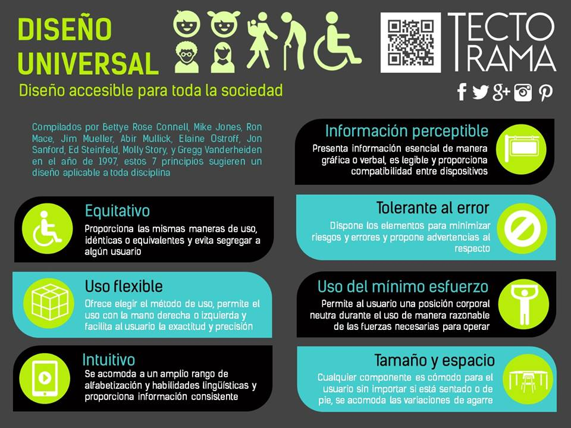

***¿Qué es el diseño universal?***  
El diseño universal debe comunicarnos algo sin necesidad de tener un sesgo cultural, geográfico o social y es muy importante, porque le da el sentido de pertenencia a la gente.

***La señalética***
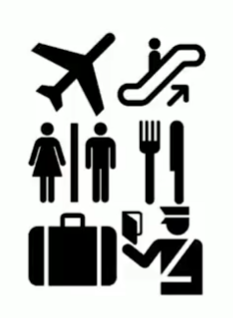

La señalética fue creada para comunicar necesidades muy específicas, por eso es funcional en cualquier parte del mundo y no está limitada culturalmente.

> Contribución creada por: Giuseppe Ramírez

***Principios de Diseños Universales:***
1. **Igualdad de uso:** el diseño debe ser fácil de usar y adecuado para todas las personas independientemente de sus capacidades y habilidades.
   * El diseño debe ser útil para todas las personas.
   * Evitar segregar o estigmatizar a cualquier usuario.
   * Todos los usuarios deben de contar con las mismas garantías de privacidad y seguridad.
   * Todos los usuarios deben de contar con las mismas garantías de privacidad y seguridad.
2. **Flexibilidad:** el diseño debe poder adecuarse a un amplio rango de preferencias y habilidades individuales.
   * Ofrecer opciones en la forma de uso.
   * Servir tanto para los diestros como para los zurdos.
   * Facilitar al usuario la precisión y exactitud.
   * Adaptar al ritmo de uso del usuario.
3. **Simple e intuitivo:** el diseño debe ser fácil de entender independientemente de la experiencia, los conocimientos, las habilidades o el nivel de concentración del usuario.
   * Eliminar la complejidad innecesaria.
   * Ser consistente con la intuición y expectativas del usuario.
   * Acomodar a un rango amplio de grados de alfabetización y conocimientos del lenguaje.
   * Ordenar la información de acuerdo a su importancia.
   * Proporcionar información y retroalimentación eficaces durante y después de la tarea.
4. **Información fácil de percibir:** el diseño debe ser capaz de intercambiar información con usuario, independientemente de las condiciones ambientales o las capacidades sensoriales del mismo.
   * Utilizar diferentes medios (pictóricos, verbales, táctiles) para la presentación de manera redundante de la información esencial.
   * Maximizar la legibilidad de la información esencial.
   * Diferenciar elementos de manera que puedan ser descritos por sí solos (por ejemplo que las instrucciones dadas sean fácil de entender).
   * Proporcionar compatibilidad con varias técnicas o dispositivos usados por personas con diversos grados de funcionalidad sensorial.
5. **Tolerante a errores:** el diseño debe minimizar las acciones accidentales o fortuitas que puedan tener consecuencias fatales o no deseadas.
   * El diseño minimiza riesgos y consecuencias adversas de acciones involuntarias o accidentales.
   * Advertir de los peligros y errores.
   * Proporcionar características para controlar las fallas.
   * Descartar acciones inconscientes en tareas que requieren concentración.
6. **Escaso esfuerzo físico:** el diseño debe poder ser usado eficazmente y con el mínimo esfuerzo posible.
   * Permitir al usuario mantener una posición neutral de su cuerpo.
   * Usar fuerzas de operación razonables.
   * Minimizar las acciones repetitivas.
   * Minimizar el esfuerzo físico constante. 
7. **Dimensiones apropiadas:** los tamaños y espacios deben ser apropiados para el alcance, manipulación y uso por parte del usuario, independientemente de su tamaño, posición, y movilidad.
   * Proporcionar un tamaño y espacio adecuado para el acercamiento, alcance, manipulación y uso, independientemente del tamaño corporal, postura o movilidad del usuario.
   * Proporcionar una forma cómoda de alcanzar todos los componentes, tanto para los usuarios de pie como sentados.
   * Acomodar variantes en el tamaño de la mano y asimiento.
   * Proporcionar un espacio adecuado para el uso de aparatos de asistencia o personal de ayuda

## **clase 6 - Diseno atemporal**

El diseño atemporal es aquel diseño que perdura en el tiempo, si esto es exitoso no cambiará y comunicará permanentemente lo mismo.
Ejemplo:
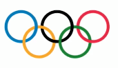   
El diseño de los juegos olímpicos no cambia desde 1912.

***Características del diseño atemporal***  
* No cambia con el tiempo.
* Crea un sentido de pertenencia.
* Información precisa.
* Mantiene una marca.

> Contribución creada por: Giuseppe Ramírez, Jean José Ferrer Bohórquez y gasparnd

Las tendencias cambian y a veces lo hacen a grandes velocidades, sin darnos cuenta, lo que antes era una cosa innovadora se convierte en algo muy visto y lo que había sido algo corriente que se había quedado desfasado se convierte en algo retro y distintivo. Por eso, hoy en día, se empieza a dar mucha importancia al diseño atemporal, a la posibilidad de combinar varios elementos de distintos estilos y combinarlos en un mismo espacio dando lugar a un diseño cohesivo.

## **CLASE 8 - El Boceto**
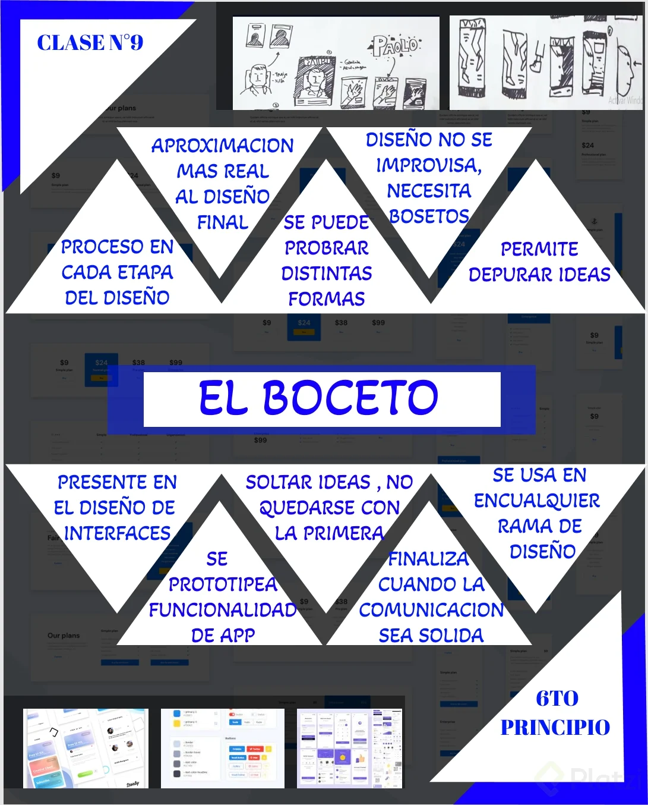

***¿Qué es el boceto?***  
Es la aproximación más real al diseño final, pues con él podemos probar distintas formas en las cuales podemos comunicar una idea, este proceso tiene que estar presente en todas fases del diseño y es necesario porque el diseño no debe tener improvisación, además nos permite depurar ideas y nos sirve para encontrar el punto en el cual nos podemos sentir cómodos con la idea que queremos comunicar; que sea concisa y exacta.

***¿Por qué hacer bocetos en lápiz y papel?***
* Es mucho más rápido.
* Las modificaciones son más libres
* Tu mente procesa las cosas de una manera diferente y te puede dar mayor capacidad para que lleguen nuevas ideas.
* Es el elemento más portable existente, además puedes dibujar sobre cualquier superficie con cualquier material.
Ejemplos de bocetos por tipos de diseño:

Diseño de interfaces
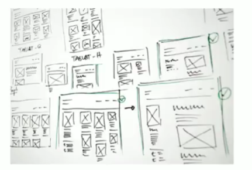

Diseño industrial  
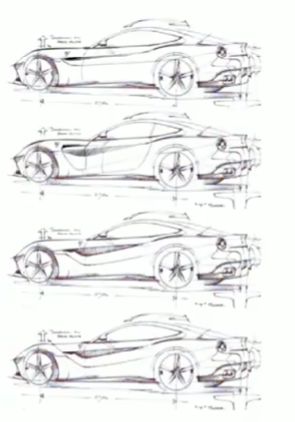

Diseño gráfico.  
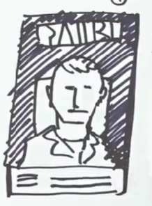

Entre otros.

> Contribución creada por: Giuseppe Ramírez y Adrian Streets

***Que es el boceto?***
* Presente en todas las ramas del diseño.
* Aguanta todas las ideas.
* Depura todas las discusiones.
* El boceto se detiene, cuando la idea está sólida para pasar a la parte final.
* Para optimizar el tiempo, en el diseño de interfaces, siempre hay que hacer bocetos.
* Solamente necesitamos un lápiz y un papel.
* El boceto nos dará la tranquilidad, ya que nos da la idea más efectiva con respecto a los lineamientos iniciales.

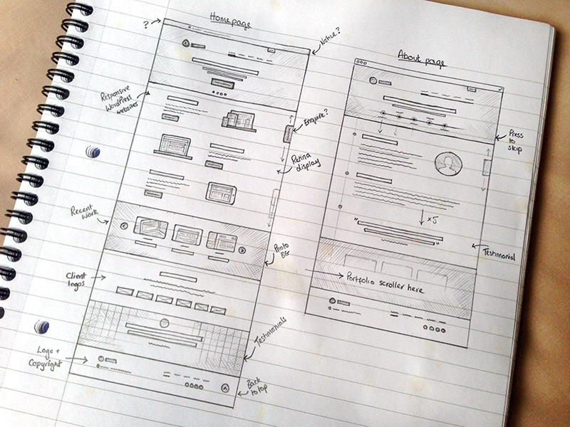

No es muy necesario, con que puedas representar tus ideas claramente de modo que puedas comunicarlas, para poder pasar a la producción del diseño,
Tambien se vale usar reglas o líneas guia de referencia, y formas geométricas básicas para crear otras formas mas complejas

El boceto es uno de los factores mas importantes en todo el proceso del diseño, el boceto es la forma de representar la idea final que estemos buscando, no importa que tipo de diseño se este desarrollando, el boceto siempre debe ser parte del proceso de creación del diseño.
Al principio los bocetos pueden ser simples, pero a medida que nos vayamos acercando al resultado final que queremos transmitir, nos serviría de gran ayuda describir y manejar de manera organizada cada parte del boceto, especificando el color de cierto elemento, el texto y su estructura, entre más detallado sea el boceto final, se nos hará mas sencillo el proceso de la creación del resultado final que queremos.

***Tips***   
* No exigirse en cuanto al dibujo, lo que queremos con el boceto es plasmar ideas y trabajarlas.
* Recortar o traer ideas y ponerlas todas en el mismo papel para componer.
* Revisar siempre el brief.
* No quedarse con la primera idea.
* Hacer apuntes o notas a los dibujos

## **Clase 9 - Elementos Visuales**

***¿Qué son los elementos visuales?***  
Los elementos visuales son recursos que nos ayudan a comunicar de forma efectiva un mensaje

Elementos visuales del diseño divididos en sus principales categorías:
1. **Fotografía:** Es un recurso que se ha usado por mucho tiempo en el diseño. Es la representación más exacta de la realidad.
2. **Ilustración:** Es la representación artística por medio del dibujo. Tiene muchas variantes (académica, síntesis, formas, siluetas). Puede ser ilustración física o digital.
3. **Tipografía:** Es la forma en que se presenta el texto. Más allá de informar también puede comunicar un sentimiento o una situación.
4. **Color:** Nos ayuda a crear una calidad e intención del mensaje, a través de su infinidad de combinaciones.
5. **Líneas y puntos:** Son elementos simples, pero nos ayudan a crear diagramación, composición, alineación.
6. **Figuras geométricas:** Son importantes porque, además de cumplir un rol visual, nos ayudan con la tarea de composición. Forman parte de todas las etapas del diseño, principalmente en la disposición de los elementos.

> Contribución creada por: Giuseppe Ramírez y Carlos Rojas

