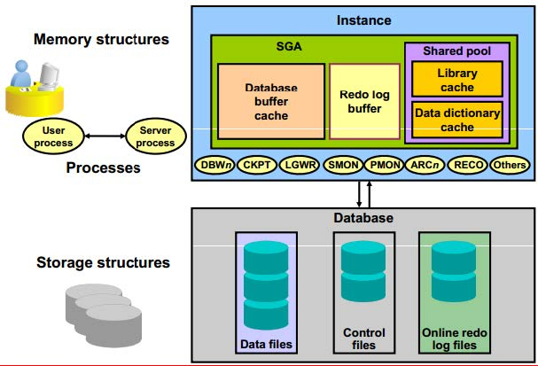
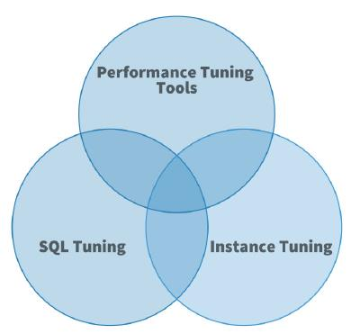
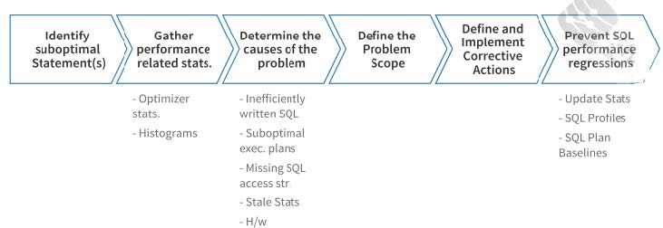
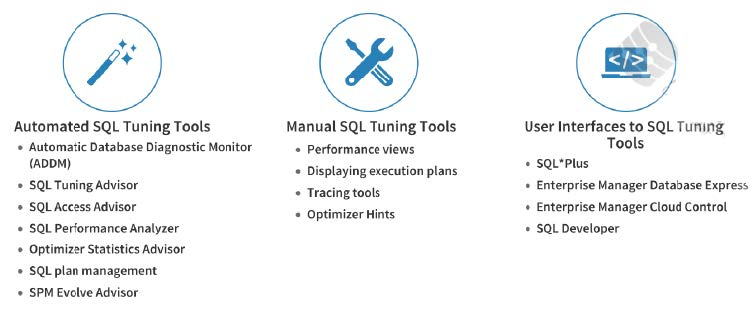
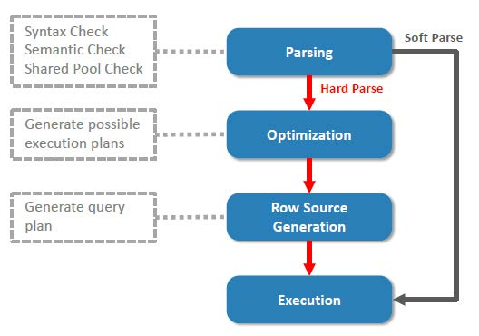

## **Oracle Database 19c Installation On Oracle Linux 7 (OL7)**
This article describes the installation of Oracle Database 19c 64-bit on Oracle Linux 7 (OL7) 64-bit. The article is based on a server installation with a minimum of 2G swap and secure Linux set to permissive. An example of this type of Linux installation can be seen here here.

* Download Software
* Hosts File
* Oracle Installation Prerequisites
* Automatic Setup
* Manual Setup
* Additional Setup
* Installation
* Database Creation
* Post Installation

***Related articles.***   
* [Oracle Universal Installations (OUI) Silent Installations](https://oracle-base.com/articles/misc/oui-silent-installations)
* [Database Configuration Assistant (DBCA) : Creating Databases in Silent Mode](https://oracle-base.com/articles/misc/database-configuration-assistant-dbca-silent-mode)

### ***Download Software***   
Download the Oracle software from OTN or MOS depending on your support status.
* [OTN: Oracle Database 19c (19.3) Software (64-bit)](https://www.oracle.com/technetwork/database/enterprise-edition/downloads/oracle19c-linux-5462157.html)
* [edelivery: Oracle Database 19c (19.3) Software (64-bit)](http://edelivery.oracle.com/)

### ***Hosts File***   
The "/etc/hosts" file must contain a fully qualified name for the server.
```
<IP-address>  <fully-qualified-machine-name>  <machine-name>
```
For example.
```
127.0.0.1       localhost localhost.localdomain localhost4 localhost4.localdomain4
192.168.56.107  ol7-19.localdomain  ol7-19
```

Set the correct hostname in the "/etc/hostname" file.
```
ol7-19.localdomain
```

### ***Oracle Installation Prerequisites***   
Perform either the Automatic Setup or the Manual Setup to complete the basic prerequisites. The Additional Setup is required for all installations.

### ***Automatic Setup***   
If you plan to use the "oracle-database-preinstall-19c" package to perform all your prerequisite setup, issue the following command.
```
yum install -y oracle-database-preinstall-19c
```
It is probably worth doing a full update as well, but this is not strictly speaking necessary.
```
yum update -y
```
 It's worth running the all the YUM commands listed in the manual setup section. Depending on the OS package groups you have selected, some additional packages might also be needed.

If you are using RHEL7 or CentOS7, you can pick up the PRM from the OL7 repository and install it. It will pull the dependencies from your normal repositories.
```
curl -o oracle-database-preinstall-19c-1.0-1.el7.x86_64.rpm https://yum.oracle.com/repo/OracleLinux/OL7/latest/x86_64/getPackage/oracle-database-preinstall-19c-1.0-1.el7.x86_64.rpm

yum -y localinstall oracle-database-preinstall-19c-1.0-1.el7.x86_64.rpm
```

### ***Manual Setup***   
If you have not used the "oracle-database-preinstall-19c" package to perform all prerequisites, you will need to manually perform the following setup tasks.

Add the following lines to the "/etc/sysctl.conf" file, or in a file called "/etc/sysctl.d/98-oracle.conf".
```
fs.file-max = 6815744
kernel.sem = 250 32000 100 128
kernel.shmmni = 4096
kernel.shmall = 1073741824
kernel.shmmax = 4398046511104
kernel.panic_on_oops = 1
net.core.rmem_default = 262144
net.core.rmem_max = 4194304
net.core.wmem_default = 262144
net.core.wmem_max = 1048576
net.ipv4.conf.all.rp_filter = 2
net.ipv4.conf.default.rp_filter = 2
fs.aio-max-nr = 1048576
net.ipv4.ip_local_port_range = 9000 65500
```
Run one of the following commands to change the current kernel parameters, depending on which file you edited.
```
/sbin/sysctl -p
# Or
/sbin/sysctl -p /etc/sysctl.d/98-oracle.conf
```
Add the following lines to a file called "/etc/security/limits.d/oracle-database-preinstall-19c.conf" file.
```
oracle   soft   nofile    1024
oracle   hard   nofile    65536
oracle   soft   nproc    16384
oracle   hard   nproc    16384
oracle   soft   stack    10240
oracle   hard   stack    32768
oracle   hard   memlock    134217728
oracle   soft   memlock    134217728
```
Someone in the comments suggested you might need to add the previous lines into the "/etc/security/limits.conf" file also for CentOS7. This is definitely not needed for OL7, but worth considering if the installer gives prerequisite failures for these settings.

The following packages are listed as required. Many of the packages should be installed already.
```
yum install -y bc    
yum install -y binutils
yum install -y compat-libcap1
yum install -y compat-libstdc++-33
#yum install -y dtrace-modules
#yum install -y dtrace-modules-headers
#yum install -y dtrace-modules-provider-headers
yum install -y dtrace-utils
yum install -y elfutils-libelf
yum install -y elfutils-libelf-devel
yum install -y fontconfig-devel
yum install -y glibc
yum install -y glibc-devel
yum install -y ksh
yum install -y libaio
yum install -y libaio-devel
yum install -y libdtrace-ctf-devel
yum install -y libXrender
yum install -y libXrender-devel
yum install -y libX11
yum install -y libXau
yum install -y libXi
yum install -y libXtst
yum install -y libgcc
yum install -y librdmacm-devel
yum install -y libstdc++
yum install -y libstdc++-devel
yum install -y libxcb
yum install -y make
yum install -y net-tools # Clusterware
yum install -y nfs-utils # ACFS
yum install -y python # ACFS
yum install -y python-configshell # ACFS
yum install -y python-rtslib # ACFS
yum install -y python-six # ACFS
yum install -y targetcli # ACFS
yum install -y smartmontools
yum install -y sysstat
# Added by me.
yum install -y unixODBC
```
Create the new groups and users.
```
groupadd -g 54321 oinstall
groupadd -g 54322 dba
groupadd -g 54323 oper
#groupadd -g 54324 backupdba
#groupadd -g 54325 dgdba
#groupadd -g 54326 kmdba
#groupadd -g 54327 asmdba
#groupadd -g 54328 asmoper
#groupadd -g 54329 asmadmin
#groupadd -g 54330 racdba

useradd -u 54321 -g oinstall -G dba,oper oracle
```
Uncomment the extra groups you require.

### ***Additional Setup***   
The following steps must be performed, whether you did the manual or automatic setup.

Set the password for the "oracle" user.
```
passwd oracle
```
Set secure Linux to permissive by editing the "/etc/selinux/config" file, making sure the SELINUX flag is set as follows.
```
SELINUX=permissive
```
Once the change is complete, restart the server or run the following command.
```
setenforce Permissive
```
If you have the Linux firewall enabled, you will need to disable or configure it, as shown here. To disable it, do the following.
```
systemctl stop firewalld
systemctl disable firewalld
```
If you are not using Oracle Linux and UEK, you will need to manually disable transparent huge pages.

Create the directories in which the Oracle software will be installed.
```
mkdir -p /u01/app/oracle/product/19.0.0/dbhome_1
mkdir -p /u02/oradata
chown -R oracle:oinstall /u01 /u02
chmod -R 775 /u01 /u02
```
Putting mount points directly under root without mounting separate disks to them is typically a bad idea. It's done here for simplicity, but for a real installation "/" storage should be reserved for the OS.

Unless you are working from the console, or using SSH tunnelling, login as root and issue the following command.
```
xhost +<machine-name>
```
The scripts are created using the cat command, with all the " $ " characters escaped. If you want to manually create these files, rather than using the cat command, remember to remove the " \ " characters before the " $ " characters.

Create a "scripts" directory.
```
mkdir /home/oracle/scripts
```
Create an environment file called "setEnv.sh". The "$" characters are escaped using "\". If you are not creating the file with the cat command, you will need to remove the escape characters.
```
cat > /home/oracle/scripts/setEnv.sh <<EOF
# Oracle Settings
export TMP=/tmp
export TMPDIR=\$TMP

export ORACLE_HOSTNAME=ol7-19.localdomain
export ORACLE_UNQNAME=cdb1
export ORACLE_BASE=/u01/app/oracle
export ORACLE_HOME=\$ORACLE_BASE/product/19.0.0/dbhome_1
export ORA_INVENTORY=/u01/app/oraInventory
export ORACLE_SID=cdb1
export PDB_NAME=pdb1
export DATA_DIR=/u02/oradata

export PATH=/usr/sbin:/usr/local/bin:\$PATH
export PATH=\$ORACLE_HOME/bin:\$PATH

export LD_LIBRARY_PATH=\$ORACLE_HOME/lib:/lib:/usr/lib
export CLASSPATH=\$ORACLE_HOME/jlib:\$ORACLE_HOME/rdbms/jlib
EOF
```
Add a reference to the "setEnv.sh" file at the end of the "/home/oracle/.bash_profile" file.
```
echo ". /home/oracle/scripts/setEnv.sh" >> /home/oracle/.bash_profile
```
Create a "start_all.sh" and "stop_all.sh" script that can be called from a startup/shutdown service. Make sure the ownership and permissions are correct.
```
cat > /home/oracle/scripts/start_all.sh <<EOF
#!/bin/bash
. /home/oracle/scripts/setEnv.sh

export ORAENV_ASK=NO
. oraenv
export ORAENV_ASK=YES

dbstart \$ORACLE_HOME
EOF
```
```
cat > /home/oracle/scripts/stop_all.sh <<EOF
#!/bin/bash
. /home/oracle/scripts/setEnv.sh

export ORAENV_ASK=NO
. oraenv
export ORAENV_ASK=YES

dbshut \$ORACLE_HOME
EOF
```
```
chown -R oracle:oinstall /home/oracle/scripts
chmod u+x /home/oracle/scripts/*.sh
```
Once the installation is complete and you've edited the "/etc/oratab", you should be able to start/stop the database with the following scripts run from the "oracle" user.
```
~/scripts/start_all.sh
~/scripts/stop_all.sh
```
You can see how to create a Linux service to automatically start/stop the database here.

### ***Installation***

---
I was configuring one of the Oracle Linux 7 server to install Oracle, which would require the use of an X11 forwarded session, So i need to Configure the X11 forwarding on my server. I'm sharing the Procedure i need to follow to get it done.

**Step 1.**  Install the xorg-x11-xauth package (if it is not already installed). For example:

``` 
yum install xorg-x11-xauth, xterm, xauth
```

**Step 2:**  Enable X11 Fowarding Settings
This is an option to configure inside your SSHD Deamon settings.
```
vim /etc/ssh/sshd_config

... 
X11Forwarding yes
...
```
save and exit

**Step 3:** Restart SSH Service
The SSH service should be restarted to apply the change configuration.

``` 
systemctl restart sshd
```

**Connect From Windows**
1. Connect through Putty or other tool as you like.
2. Enable X11
3. Start the session

**Connect From  Linux**
``` 
ssh -X root@remote-server
```

---
Switch to the ORACLE_HOME directory, unzip the software directly into this path and start the Oracle Universal Installer (OUI) by issuing one of the following commands in the ORACLE_HOME directory. The interactive mode will display GUI installer screens to allow user input, while the silent mode will install the software without displaying any screens, as all required options are already specified on the command line.

***Unzip software.***
```
cd $ORACLE_HOME

unzip -oq /path/to/software/LINUX.X64_193000_db_home.zip
```

***Indicar version de Oracle a Instalar***
cuando se utiliza linux version mayor a 8.0 se presenta un error aun cuando esta documentado su uso en dicha version por lo que hay que indicar como variable otra version de trabajo.

```
export CV_ASSUME_DISTID=OEL7.9
```

***Interactive mode.***
```
./runInstaller
```
**Silent mode.**  
```
./runInstaller -ignorePrereq -waitforcompletion -silent  
    -responseFile ${ORACLE_HOME}/install/response/db_install.rsp oracle.install.option=INSTALL_DB_SWONLY                                    \
    ORACLE_HOSTNAME=${ORACLE_HOSTNAME}                                         \
    UNIX_GROUP_NAME=oinstall                                                   \
    INVENTORY_LOCATION=${ORA_INVENTORY}                                        \
    SELECTED_LANGUAGES=en,en_GB                                                \
    ORACLE_HOME=${ORACLE_HOME}                                                 \
    ORACLE_BASE=${ORACLE_BASE}                                                 \
    oracle.install.db.InstallEdition=EE                                        \
    oracle.install.db.OSDBA_GROUP=dba                                          \
    oracle.install.db.OSBACKUPDBA_GROUP=dba                                    \
    oracle.install.db.OSDGDBA_GROUP=dba                                        \
    oracle.install.db.OSKMDBA_GROUP=dba                                        \
    oracle.install.db.OSRACDBA_GROUP=dba                                       \
    SECURITY_UPDATES_VIA_MYORACLESUPPORT=false                                 \
    DECLINE_SECURITY_UPDATES=true
```    
Run the root scripts when prompted.

As a root user, execute the following script(s):   
1. /u01/app/oraInventory/orainstRoot.sh
2. /u01/app/oracle/product/19.0.0/dbhome_1/root.sh  

You can read more about silent installations here.
You are now ready to create a database.

### **Database Creation**
You create a database using the Database Configuration Assistant (DBCA). The interactive mode will display GUI screens to allow user input, while the silent mode will create the database without displaying any screens, as all required options are already specified on the command line.

**# Start the listener.**
```
lsnrctl start
```

***Interactive mode.***
```
dbca
```
***Silent mode.***
```
dbca -silent -createDatabase                                                   \
     -templateName General_Purpose.dbc                                         \
     -gdbname ${ORACLE_SID} -sid  ${ORACLE_SID} -responseFile NO_VALUE         \
     -characterSet AL32UTF8                                                    \
     -sysPassword SysPassword1                                                 \
     -systemPassword SysPassword1                                              \
     -createAsContainerDatabase true                                           \
     -numberOfPDBs 1                                                           \
     -pdbName ${PDB_NAME}                                                      \
     -pdbAdminPassword PdbPassword1                                            \
     -databaseType MULTIPURPOSE                                                \
     -memoryMgmtType auto_sga                                                  \
     -totalMemory 2000                                                         \
     -storageType FS                                                           \
     -datafileDestination "${DATA_DIR}"                                        \
     -redoLogFileSize 50                                                       \
     -emConfiguration NONE                                                     \
     -ignorePreReqs
```

You can read more about silent database creation here.

### ***Post Installation***
Edit the "/etc/oratab" file setting the restart flag for each instance to 'Y'.
```
cdb1:/u01/app/oracle/product/19.0.0/dbhome_1:Y
```

Enable Oracle Managed Files (OMF) and make sure the PDB starts when the instance starts.
```
sqlplus / as sysdba

alter system set db_create_file_dest='${DATA_DIR}';

alter pluggable database ${PDB_NAME} save state;

exit;
```

## **SwingBench**

[SwingBench 2.6](https://www.dominicgiles.com/downloads.html)

Swingbench is a free load generator (and benchmarks) designed to stress test an Oracle database (12c, 18c, 19c). 

**About SwingBench**

SwingBench consists of a load generator, a coordinator and a cluster overview. The software enables a load to be generated and the transactions/response times to be charted.  
Swingbench can be used to demonstrate and test technologies such as Real Application Clusters, Online table rebuilds, Standby databases, Online backup and recovery etc.   
The code that ships with SwingBench includes 6 benchmarks, OrderEntry, SalesHistory, TPC-DS Like, JSON, CallingCircle and StressTest..

* OrderEntry is based on the "oe" schema that ships with Oracle 12c/Oracle 18c/Oracle 19c. It has been modified so that Spatial, Intermedia schema's do not need to be installed. It can be run continuously (that is until you run out of space). It introduces heavy contention on a small number of tables and is designed to stress interconnects and memory. It is installed using the "oewizard" located in the bin directory. Both a pure jdbc and pl/sql (lower network overhead) variant exist of the benchmark.
* SalesHistory is based on the “sh” schema that ships with Oracle 12c/Oracle 18c/Oracle 19c and is designed to test the performance of complicated queries when run against large tables. It is read only and can be scaled over a number of default sizes from 1GB to 1TB. A custom mode also allows for the creation of smaller and larger schemas
* CallingCircle (deprecated) simulates the SQL that is generated for an online telco application. It requires data files to be generated and copied from the database server to the load generator before each run, it typically requires between 1 and 8 GB of disk space. Both benchmarks are heavily CPU intensive. Experience has shown that you require at least 1 processor of load generator to every 2 processors of database server. It is designed to stress the CPU and memory without the need for a powerful I/O subsystem. Its is installed using the "ccwizard" located in the bin directory
* StressTest simply fires random inserts,updates,selects and updates against a well know table.
* JSON Stresstest is based on simple JSON documents modelling people flying between airports. It follow a basic CRUD model
* TPC-DS Like Benchmark is a benchmark similar to TPC-DS. It features both a query and transaction workload in separate configuration files.

The entire framework is developed in Java and as a result can be run on wide variety of platforms. It also provides a simple API to allow developers to build their own benchmarks.

## SQL Administrator

[Administracion de DB](https://docs.oracle.com/en/database/oracle/oracle-database/19/cncpt/index.html "Administracion de DB")

## Desarrollo SQL

***Metodologia del Rendimiento***

**Pautas para el Modelado de Datos**
En el modelado de Datos es importante aplicar mayores esfuerzos de modelado a aquellas entidades afectadas por las transacciones comerciales más frecuentes.

**Pautas para aplicacaciones eficientes**

* ***Buena gestión de la conexión a la base de datos.***
  * La conexión a la base de datos es una operación costosa que no es escalable. Por lo tanto, una mejor práctica es minimizar la cantidad de conexiones simultáneas a la base de datos. 
  * Un sistema simple, donde un usuario se conecta en la inicialización de la aplicación, es ideal. 
  * En una aplicación basada en web o de varios niveles en la que los servidores de aplicaciones multiplexan las conexiones de la base de datos a los usuarios, este enfoque puede ser difícil. Con este tipo de aplicaciones, diséñelas para agrupar conexiones de base de datos y no restablecer conexiones para cada solicitud de usuario.

* ***Buen uso y gestión del cursor.***
  * Mantener las conexiones de los usuarios es igualmente importante para minimizar la actividad de análisis en el sistema. 
  * El análisis es el proceso de interpretar una declaración SQL y crear un plan de ejecución para ella. Este proceso tiene muchas fases, incluida la verificación de sintaxis, la verificación de seguridad, la generación del plan de ejecución y la carga de estructuras compartidas en el grupo compartido. 
  * Hay dos tipos de operaciones de análisis:
    * **Análisis duro** Se envía una instrucción SQL por primera vez y no se encuentra ninguna coincidencia en el grupo compartido. Los análisis duros son los más intensivos en recursos y no escalables, porque realizan todas las operaciones involucradas en un análisis.
    * **Análisis suave** Se envía una instrucción SQL por primera vez y se encuentra una coincidencia en el grupo compartido. La coincidencia puede ser el resultado de una ejecución anterior por parte de otro usuario. La instrucción SQL se comparte, lo que es óptimo para el rendimiento. Sin embargo, los análisis suaves no son ideales, porque aún requieren verificación de sintaxis y seguridad, que consumen recursos del sistema.

  * Debido a que el análisis debe minimizarse tanto como sea posible, los desarrolladores de aplicaciones deben diseñar sus aplicaciones para analizar las instrucciones SQL una vez y ejecutarlas muchas veces. Esto se hace a través de cursores. Los programadores de SQL experimentados deben estar familiarizados con el concepto de abrir y volver a ejecutar cursores.

* ***Uso efectivo de variables de vinculación***
  * Los desarrolladores de aplicaciones también deben asegurarse de que las declaraciones SQL se compartan dentro del grupo compartido. Para lograr este objetivo, utilice variables de vinculación para representar las partes de la consulta que cambian de una ejecución a otra.

Declaración con literales de cadena:
```SQL
SELECT * 
FROM   employees 
WHERE  last_name LIKE 'KING';
```
Declaración con variables de enlace:
```SQL
SELECT * 
FROM   employees 
WHERE  last_name LIKE :1;
```
El siguiente ejemplo muestra los resultados de algunas pruebas en una aplicación OLTP simple:
```TXT
Test                         #Users Supported
No Parsing all statements           270 
Soft Parsing all statements         150
Hard Parsing all statements          60
Re-Connecting for each Transaction   30
```
Estas pruebas se realizaron en una computadora de cuatro CPU. Las diferencias aumentan a medida que aumenta el número de CPU en el sistema. 

**Pauta para Implementar Aplicaciones**   
* ***Directrices para la Implementacion en un Entorno de Prueba***
  * Utilice el Monitor de diagnóstico automático de bases de datos (ADDM) y el Asesor de ajuste de SQL para la validación del diseño.
  * Realice pruebas con volúmenes y distribuciones de datos realistas.
  * Utilice el modo optimizador correcto.
  * Pruebe el rendimiento de un solo usuario.
  * Obtenga y documente planes para todas las sentencias SQL.
  * Intente la prueba multiusuario.
  * Pruebe con la configuración de hardware correcta.
  * Medir el rendimiento de estado estable.

* ***Directrices para el lanzamiento de Aplicaciones***   
  * Cuando se implementan nuevas aplicaciones, comúnmente se adoptan dos estrategias: 
    * **el enfoque Big Bang**, en el que todos los usuarios migran al nuevo sistema a la vez, 
    * y **el enfoque gradual**, en el que los usuarios migran lentamente de los sistemas existentes al nuevo.


## SQL Tunning

[Web SQL Tunning Guide 21c](https://docs.oracle.com/en/database/oracle/oracle-database/21/tgsql/introduction-to-sql-tuning.html#GUID-B653E5F3-F078-4BBC-9516-B892960046A2)

***Optimizacion de SQL***   
```
Es el intento de diagnosticar y reparar sentencias de SQL que no cumplen con un estándar de rendimiento. 
```

**ajuste de SQL** es el proceso iterativo de mejorar el rendimiento de las sentencias de SQL para cumplir objetivos específicos, medibles y alcanzables.

El ajuste de SQL implica solucionar problemas en las aplicaciones implementadas. Por el contrario, el diseño de aplicaciones establece los objetivos de seguridad y rendimiento antes de implementar una aplicación. 

Una declaración de SQL se convierte en un problema cuando no funciona de acuerdo con un estándar predeterminado y medible. 

Una vez que haya identificado el problema, una sesión de ajuste típica tiene uno de los siguientes objetivos:
  * **Reducir el tiempo de respuesta del usuario**, lo que significa disminuir el tiempo entre el momento en que un usuario emite una declaración y recibe una respuesta.
  * **Mejore rendimiento**, lo que significa usar la menor cantidad de recursos necesarios para procesar todas las filas a las que accede una declaración

**En el ajuste proactivo**, utiliza regularmente SQL Tuning Advisor para determinar si puede hacer que las sentencias de SQL funcionen mejor.   
**En el ajuste de SQL reactivo**, corrige un problema relacionado con SQL que ha experimentado un usuario. 

***Tareas de Ajuste SQL***
1. **Identificación de sentencias SQL de alta carga**, Revise el historial de ejecución anterior para encontrar las declaraciones responsables de una gran parte de la carga de trabajo de la aplicación y los recursos del sistema.
2. **Recopilación de datos relacionados con el rendimiento**, Las estadísticas del optimizador son cruciales para el ajuste de SQL. Si estas estadísticas no existen o ya no son precisas, el optimizador no puede generar el mejor plan. Otros datos relevantes para el rendimiento de SQL incluyen la estructura de tablas y vistas a las que accedió la declaración y las definiciones de cualquier índice disponible para la declaración.
3. **Determinación de las causas del problema.**, Por lo general, las causas de los problemas de rendimiento de SQL incluyen:
   * **Sentencias SQL diseñadas de manera ineficiente** Si se escribe una instrucción SQL de modo que realice un trabajo innecesario, entonces el optimizador no puede hacer mucho para mejorar su rendimiento. Ejemplos de diseño ineficiente incluyen
       * Omitir agregar una condición de unión , lo que conduce a una unión cartesiana
       * Uso de sugerencias para especificar una tabla grande como tabla de control en una combinación especificando UNION en vez de UNION ALL
       * Hacer que una subconsulta se ejecute para cada fila en una consulta externa
   * **Planes de ejecución subóptimos** El optimizador de consultas (también llamado optimizador) es un software interno que determina qué plan de ejecución es más eficiente.
   * **Faltan estructuras de acceso SQL** La ausencia de estructuras de acceso SQL, como índices y vistas materializadas, es una razón típica del rendimiento SQL subóptimo.
   * **Estadísticas obsoletas del optimizador** Estadísticas recopiladas por DBMS_STATS puede volverse obsoleto cuando las operaciones de mantenimiento de estadísticas, ya sea automáticas o manuales, no pueden mantenerse al día con los cambios en los datos de la tabla causados ​​por DML.
   * **Problemas de hardware** El rendimiento subóptimo puede estar relacionado con problemas de memoria, E/S y CPU.
4. **Definición del alcance del problema.** El alcance de la solución debe coincidir con el alcance del problema. Considere un problema a nivel de base de datos y un problema a nivel de declaración. Por ejemplo, el grupo compartido es demasiado pequeño, lo que hace que los cursores se agoten rápidamente, lo que a su vez provoca muchos análisis difíciles. El uso de un parámetro de inicialización para aumentar el tamaño del grupo compartido soluciona el problema en el nivel de la base de datos y mejora el rendimiento de todas las sesiones. Sin embargo, si una sola instrucción SQL no utiliza un índice útil, cambiar los parámetros de inicialización del optimizador para toda la base de datos podría dañar el rendimiento general. Si una sola declaración de SQL tiene un problema, entonces una solución con el alcance apropiado aborda solo este problema con esta declaración.
5. **Implementación de acciones correctivas para el desempeño subóptimo de sentencias SQL** Estas acciones varían dependiendo de las circunstancias. Por ejemplo, puede reescribir una declaración SQL para que sea más eficiente, evitando un análisis duro innecesario al reescribir la declaración para usar variables de vinculación. También puede usar equijoins, eliminar funciones de WHERE cláusulas y dividir una instrucción SQL compleja en varias instrucciones simples.   
En algunos casos, no se mejora el rendimiento de SQL reescribiendo la instrucción, sino reestructurando los objetos del esquema. Por ejemplo, puede indexar una nueva ruta de acceso o reordenar las columnas en un índice concatenado. También puede particionar una tabla, introducir valores derivados o incluso cambiar el diseño de la base de datos.
6. **Prevención de regresiones de rendimiento de SQL** Para garantizar un rendimiento óptimo de SQL, verifique que los planes de ejecución continúen brindando un rendimiento óptimo y elija mejores planes si están disponibles. Puede lograr estos objetivos utilizando estadísticas del optimizador, perfiles SQL y líneas base del plan SQL.

***Herramientas de Ajuste SQL***   
Todas las herramientas de ajuste dependen de las herramientas básicas de las vistas, estadísticas y métricas de rendimiento dinámico que recopila la instancia de la base de datos. La propia base de datos contiene los datos y metadatos necesarios para ajustar las sentencias SQL. 
1. **Herramientas de ajuste de SQL automatizadas**   
**La administración del plan de SQL** es un mecanismo que puede evitar regresiones en el rendimiento y también ayudarlo a mejorar el rendimiento de SQL.    
Un conjunto de ajuste de SQL (STS) es un objeto de base de datos que incluye una o más declaraciones de SQL junto con sus estadísticas de ejecución y contexto de ejecución. 
* **Monitor de diagnóstico de base de datos automático (ADDM)** ADDM y otros asesores utilizan Repositorio de carga de trabajo automático (AWR), que es una infraestructura que brinda servicios a los componentes de la base de datos para recopilar, mantener y usar estadísticas.
* **Asesor de Automatizacion de SQL** SQL Tuning Advisor es un software de diagnóstico interno que identifica sentencias SQL problemáticas y recomienda cómo mejorar el rendimiento de las sentencias. 
    Tipos de Analisis:
    * **Comprueba si hay estadisticas obsoletas o faltantes**
    * **Construye perfiles SQL.** Un perfil de SQL es un conjunto de información auxiliar específica de una declaración de SQL. Un perfil de SQL contiene correcciones para estimaciones subóptimas del optimizador descubiertas durante el ajuste automático de SQL. Esta información puede mejorar las estimaciones del optimizador para la cardinalidad , que es el número de filas que se estima o realmente devuelve una operación en un plan de ejecución, y la selectividad. Estas estimaciones mejoradas llevan al optimizador a seleccionar mejores planes. 
    * Explora si una **ruta de acceso diferente** puede mejorar significativamente el rendimiento
    * **Identifica sentencias SQL que se prestan a planes subóptimos** 
* **Asesor de Acceso SQL** SQL Access Advisor es un software de diagnóstico interno que recomienda qué vistas materializadas, índices y registros de vistas materializadas se deben crear, descartar o conservar. 
* **Indexacion Automatica** Oracle Database puede monitorear constantemente la carga de trabajo de la aplicación, creando y administrando índices automáticamente.

### ***Notas Rapidas de Clases***

***Arquitectura de la Base de Datos a tomar en cuenta.***


***Areas de Mejora para la Base de datos.***   


***Definicion de la Mejora de SQL***   
Un proceso iterativo para mejorar el rendimiento de las sentencias SQL para cumplir objetivos especificos, medibles y alcanzables.   
Medible en base:
* Reducir el tiempo de respuesta.
* Mejora el rendimiento reduciendo el uso de recursos.

***Tareas Realizadas en una Session de Mejora***   


***Herramientas para Mejora de SQL***    


***Proceso de Optimizer Query SQL***   



### ***Notas de Laboratorios***
**utlxplan.sql** genera la **tabla PLAN_TABLE**, es la tabla de salida por defecto en la cual la sentencia **EXPLAIN PLAN** inserta las filas que describe el plan de ejecucion seleccionado por el generador de planes del optimizador de una base de datos.

