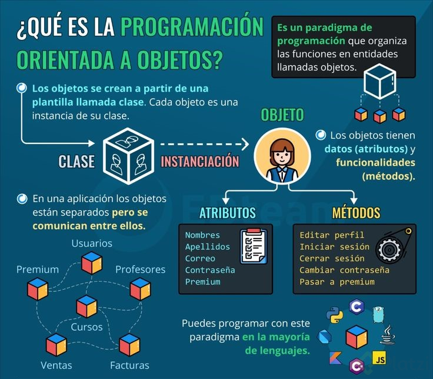

# JAVA (Lenguaje de Programacion y Plataforma Informatica)
**Java es un lenguaje de programación y una plataforma informática que fue comercializada por primera vez en 1995 por Sun Microsystems.** Hay muchas aplicaciones y sitios web que no funcionarán, probablemente, a menos que tengan Java instalado, y cada día se crean más. Java es rápido, seguro y fiable. Desde ordenadores portátiles hasta centros de datos, desde consolas para juegos hasta computadoras avanzadas, desde teléfonos móviles hasta Internet, Java está en todas partes. Si es ejecutado en una plataforma no tiene que ser recompilado para correr en otra. Java es, a partir de 2012, uno de los lenguajes de programación más populares en uso, particularmente para aplicaciones de cliente-servidor de web, con unos diez millones de usuarios reportados.   
El lenguaje de programación Java fue desarrollado originalmente por James Gosling, de Sun Microsystems (constituida en 1983 y posteriormente adquirida el 27 de enero de 2010 por la compañía Oracle), y publicado en 1995 como un componente fundamental de la plataforma Java de Sun Microsystems. **Su sintaxis deriva en gran medida de C y C++,** pero tiene menos utilidades de bajo nivel que cualquiera de ellos. **Las aplicaciones de Java son compiladas a bytecode (clase Java), que puede ejecutarse en cualquier máquina virtual Java (JVM) sin importar la arquitectura de la computadora subyacente**.  
La compañía Sun desarrolló la implementación de referencia original para los compiladores de Java, máquinas virtuales y librerías de clases en 1991, y las publicó por primera vez en 1995. A partir de mayo de 2007, en cumplimiento de las especificaciones del Proceso de la Comunidad Java, Sun volvió a licenciar la mayoría de sus tecnologías de Java bajo la Licencia Pública General de GNU. Otros han desarrollado también implementaciones alternas a estas tecnologías de Sun, tales como el Compilador de Java de GNU y el GNU Classpath.

# PYTHON ()
**Python es un lenguaje de alto nivel de programación interpretado cuya filosofía hace hincapié en la legibilidad de su código, se utiliza para desarrollar aplicaciones de todo tipo,** ejemplos: Instagram, Netflix, Panda 3D, entre otros. Se trata de un lenguaje de programación multiparadigma, ya que soporta parcialmente la orientación a objetos, programación imperativa y, en menor medida, programación funcional. Es un lenguaje interpretado, dinámico y multiplataforma.

Administrado por Python Software Foundation, posee una licencia de código abierto, denominada Python Software Foundation License.3​ Python se clasifica constantemente como uno de los lenguajes de programación más populares. 

# PHP (Personal Home Page / Hypertext Preprocessor)

PHP es un lenguaje de programación de uso general que se adapta especialmente al desarrollo web. Fue creado inicialmente por el programador danés-canadiense Rasmus Lerdorf en 1994. En la actualidad, la implementación de referencia de PHP es producida por The PHP Group.​ PHP originalmente significaba Personal Home Page (Página personal), pero ahora significa el inicialismon recursivo PHP: Hypertext Preprocessor.   
El **código PHP suele ser procesado en un servidor web por un intérprete PHP implementado como un módulo, un daemon o como un ejecutable de interfaz de entrada común (CGI)**. En un servidor web, el resultado del código PHP interpretado y ejecutado —que puede ser cualquier tipo de datos, como el HTML generado o datos de imágenes binarias— formaría la totalidad o parte de una respuesta HTTP. Existen diversos sistemas de plantillas, sistemas de gestión de contenidos y frameworks que pueden emplearse para organizar o facilitar la generación de esa respuesta. Por otra parte, **PHP puede utilizarse para muchas tareas de programación fuera del contexto de la web, como aplicaciones gráficas autónomas y el control de drones.** También se puede interpretar y ejecutar un código PHP cualquiera a través de una interfaz de línea de comandos (CLI).   
El **intérprete estándar de PHP, impulsado por Motor Zend, es un software libre publicado bajo Licencia PHP**. PHP ha sido ampliamente portado y puede ser desplegado en la mayoría de los servidores web en casi todos los sistemas operativos y plataformas, de forma gratuita.
El lenguaje **PHP evolucionó sin una especificación formal escrita o un estándar hasta 2014**, con la implementación original actuando como el estándar de facto que otras implementaciones intentaban seguir. Desde 2014, se ha trabajado para crear una especificación formal de PHP.
Para abril de 2020, más de la mitad de los sitios en la web que usaban PHP seguían en la versión descontinuada 5.6 o anterior y con la versión 7.0 y 7.1 más del 68%, que no están oficialmente soportadas por The PHP Development Team,mientras que el soporte de seguridad es proporcionado por terceros, como Debian (hasta junio de 2020 para PHP 5).Adicionalmente, la versión 7.2, la versión con soporte más popular, dejó de recibir actualizaciones de seguridad el 30 de noviembre de 2020.

# Que es la programacion orientada a Objetos?

La programación Orientada a objetos se define como un paradigma de la programación, una manera de programar específica, donde se organiza el código en unidades denominadas clases, de las cuales se crean objetos que se relacionan entre sí para conseguir los objetivos de las aplicaciones.

La programación Orientada a objetos (POO) es una forma especial de programar, más cercana a como expresaríamos las cosas en la vida real que otros tipos de programación.

Al programar orientado a objetos tenemos que aprender a pensar cómo resolver los problemas de una manera distinta a como se realizaba anteriormente, en la programación estructurada. Ahora tendremos que escribir nuestros programas en términos de clases, objetos, propiedades, métodos y otras cosas que veremos rápidamente para aclarar conceptos y dar una pequeña base que permita soltarnos un poco con los conceptos de este tipo de programación.

## **¿Por qué programar orientándose en objetos?**   
Durante años, los programadores se han dedicado a construir aplicaciones muy parecidas que resolvían una y otra vez los mismos problemas. Para conseguir que los esfuerzos de los programadores puedan ser reutilizados se creó la posibilidad de utilizar módulos. El primer módulo existente fue la función, que somos capaces de escribir una vez e invocar cualquier número de veces.

Sin embargo, la función se centra mucho en aportar una funcionalidad dada, pero no tiene tanto interés con los datos. Es cierto que la función puede recibir datos como parámetros, pero los trata de una forma muy volatil. Simplemente hace su trabajo, procesando los parámetros recibidos y devuelve una respuesta.

En las aplicaciones en realidad los datos están muy ligados a la funcionalidad. Por ejemplo podemos imaginar un punto que se mueve por la pantalla. El punto tiene unas coordenadas y podemos trasladarlo de una posición a otra, sumando o restando valores a sus coordenadas. Antes de la programación orientada a objetos ocurría que cada coordenada del punto tenía que guardarse en una variable diferente (dos variables para ser exacto: x, y) y las funciones de traslación estaban almacenadas por otra parte. Esta situación no facilitaba la organización del código ni tampoco su reutilización.

Con la Programación Orientada a Objetos se buscaba resolver estas situaciones, creando unas mejores condiciones para poder desarrollar aplicaciones cada vez más complejas, sin que el código se volviera un caos. Además, se pretendía dar una de pautas para realizar las cosas de manera que otras personas puedan utilizarlas y adelantar su trabajo, de manera que consigamos que el código se pueda reutilizar.

La POO no es difícil, pero es una manera especial de pensar, a veces subjetiva de quien la programa, de manera que la forma de hacer las cosas puede ser diferente según el programador. Aunque podamos hacer los programas de formas distintas, no todas ellas son correctas, lo difícil no es programar orientado a objetos sino programar bien. Programar bien es importante porque así nos podemos aprovechar de todas las ventajas de la POO.

## **¿Cómo se piensa en objetos?**  
Pensar en términos de objetos es muy parecido a cómo lo haríamos en la vida real. Por ejemplo vamos a pensar en un coche para tratar de modelizarlo en un esquema de POO. Diríamos que el coche es el elemento principal que tiene una serie de características, como podrían ser el color, el modelo o la marca. Además tiene una serie de funcionalidades asociadas, como pueden ser ponerse en marcha, parar o aparcar.

Pues en un esquema POO “el coche” sería lo que se conoce como “Clase”. Sus características, como el color o el modelo, serían propiedades y las funcionalidades asociadas, como ponerse en marcha o parar, serían métodos.

La clase es como un libro, que describe como son todos los objetos de un mismo tipo. La clase coche describe cómo son todos sus coches, qué propiedades tienen y qué funcionalidades deben poder realizar. A partir de una clase podemos crear cualquier número de objetos de esa clase. Un coche rojo que es de la marca Ford y modelo Fiesta, otro verde que es de la marca Seat y modelo Ibiza.

Por poner otro ejemplo vamos a ver cómo modelizaríamos en un esquema POO una fracción, es decir, esa estructura matemática que tiene un numerador y un denominador que divide al numerador, por ejemplo 3/2.

La fracción será la clase y tendrá dos propiedades, el numerador y el denominador. Luego podría tener varios métodos como simplificarse, sumarse con otra fracción o número, restarse con otra fracción, etc.

A partir de la definición de una fracción (la clase) podremos construir un número indeterminado de objetos de tipo fracción. Por ejemplo podemos tener el objeto fracción 2/5 o 3/9, 4/3, etc. Todos esos son objetos de la clase fracción de números enteros.

Estas clases se podrán utilizar en los programas, por ejemplo en un programa de matemáticas harás uso de la clase fracción y construirás muchos objetos de tipo fracción para hacer cuentas diversas. En un programa que gestione un taller de coches utilizarás la clase coche y se instanciarán diversos objetos de tipo coche para hacer las operativas.

En los lenguajes puramente orientados a objetos, tendremos únicamente clases y objetos. Las clases permitirán definir un número indeterminado de objetos, que colaboran entre ellos para resolver los problemas. Con muchos objetos de diferentes clases conseguiremos realizar las acciones que se desean implementar en la funcionalidad de la aplicación. Además, las propias aplicaciones como un todo, también serán definidas por medio de clases. Es decir, el taller de coches será una clase, de la que podremos crear el objeto taller de coches, que utilizará objetos coche, objetos de clase herramienta, objetos de clase mecánico, objetos de clase recambio, etc.

# POO tiene dos corrientes principales:

## Basado en Clases: 
Es la más ampliamente usada por los lenguajes POO. Por ejemplo es usada por Java, C++ y C#. Se basa en crear una estructura molde llamada clase donde se especifican los campos y métodos que tendrán nuestros objetos. Cada vez que necesitamos un objeto creamos una copia del objeto (instancia) usando la clase como molde.

## Basada en prototipo: 
Es soportado en Javascript, Python y Ruby. No hay clases, solo hay objetos. El mecanismo para la reutilización está dado por la clonación de objetos. Se crean directamente los objetos y cuando se quiere generar otro con la misma estructura se usa clonación. Una vez clonado si queremos podemos agregar los campos y métodos necesarios. Un objeto prototípico es un objeto que se utiliza como una plantilla a partir de la cual se obtiene el conjunto inicial de propiedades de un objeto. Cualquier objeto puede ser utilizado como el prototipo de otro objeto, permitiendo al segundo objeto compartir las propiedades del primero.

