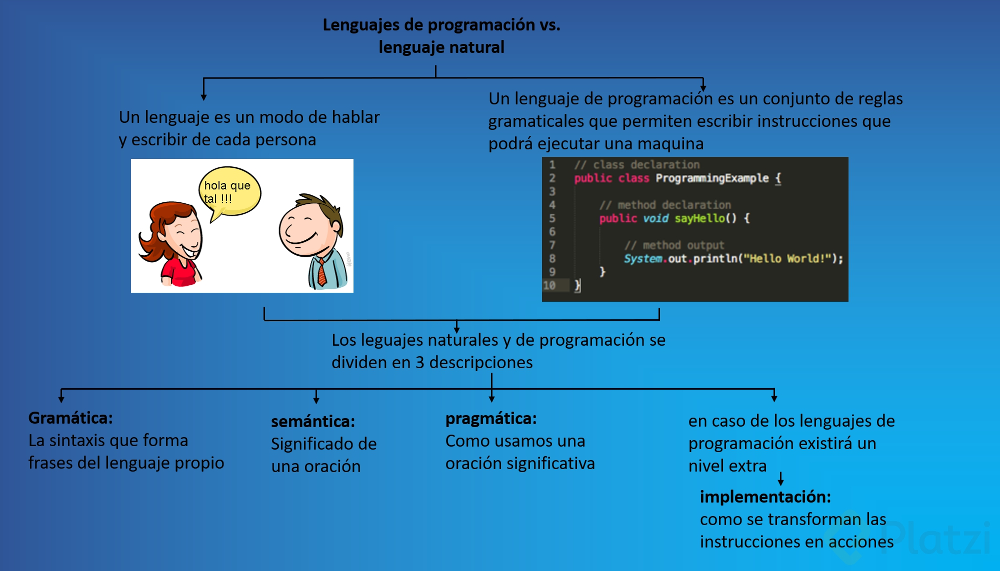
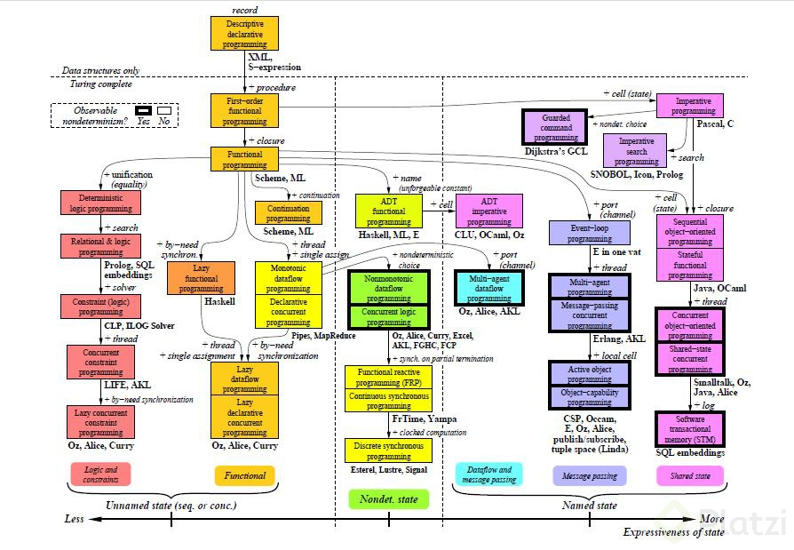
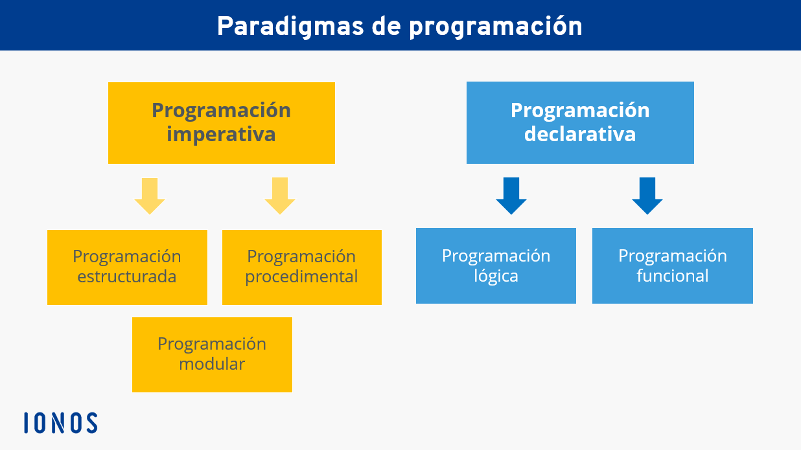

# Paradigmas de la Programacion

Que es la Programacion Imperativa?
Que es la Programacion Declarativa?
Que es la Programacion Funcional?


## Paradigma
Teoria o conjunto de teorias cuyo nucleo conceptual se acepta sin cuestionar y suministra la base y modelo para resolver problemas y avanzar en el conocimiento.   
Un paradigma de programacion, es un metodo para resolver o realizar una tarea. Si bien existen diferentes lenguajes de programacion se necesita de una estrategia cuando se implementa un camino, y este puede ser los paradigmas.

## Conceptos claves

👇
### ***Lenguajes de programación vs Lenguaje natural***
Un lenguaje lo usamos entre humanos para comunicarnos, expresar nuestros sentimientos, o incluso de forma colaborativa para llegar a un fin.   
En las computadoras, nosotros usamos un lenguaje de programación para decirle qué hacer, cómo hacerlo, a través de qué recursos. Algunos lenguajes permiten ser especifico con las instrucciones.   
> La computadora no comete errores, nosotros dimos mal las instrucciones.

### ***¿Qué es un lenguaje?***
Estilo y modo de hablar y escribir de cada persona en particular.

### ***Lenguaje de programación***
Un lenguaje de programación es un formalismo artificial en el cual los algoritmos pueden ser expresados.



### ***Niveles de descripción***
***Gramática Responde a ¿Qué oraciones son las correctas?***
* Secuencias y símbolos que forman palabras/tokens
* Sintaxis para formar frases del lenguaje propio,

***Semántica Responde a ¿Qué significan las palabras?***
* While/mientras
* Variables
* Funciones
* Clases

***Pragmática Responde al ¿Cómo usarlos?¿Cómo utilizamos una oración significativa?**     
Entender de pragmática en la programación es importante, ya que al comunicarnos con la computadora, la computadora puede interpretar de una forma diferente y de ahí se derivan diferentes problemas.
De hecho, por cuestión de pragmática, una regla general de los lenguajes de programación es que no pueden ser ambiguos, es decir, tú no puedes generar una sentencia en un lenguaje de programación que tenga más de un significado.   
Esto es algo importante de tener en mente, sobre todo cuando vas a crear un lenguaje de programación, recuerda que una instrucción debe significar una sola cosa.

***Implementación***
Es la forma en que se transforman esas instrucciones en acciones.

### ***¿Qué son los paradigmas de programación?***
Teoría o conjunto de teorías cuto núcleo central se acepta sin cuestionar y que suministra la base y modelo para resolver problemas y avanzar en el conocimiento

### ***Clasificación de lenguajes***
Basado en sus características y entendiendo que existen lenguajes multiparadigma.   
***Estilo de programación***    
Por su forma de abordar un problema o herramienta utilizadas.
* Paradigmas puros   
    Smalltalk → P.O.O   
    Haskell → Funcional

* Multiparadigma   
  C++, Java, JavaScript, Scala, PHP, Python, Ruby, F#, etc.

***¿Qué significa tener un paradigma?***   
Prohibir o limitar ciertas acciones:   
  Efectos colaterales
  Uso de goto.



### ***¿Cuáles son los principales paradigmas de programación?***
Existen mas de 100 paradigmas distintos
***Principales paradigmas***
* Imperativo
  * Por procedimientos
  * Orientado a objetos
* Declarativo
  * Funcional
  * Lógico
  * Matemático
  * Reactivo
* Dirigido por eventos

***Programación imperativa***
* Ordenes directas de qué hacer
* Enfocado al “Cómo”
* Instrucciones paso a paso
  * Fortran, Java, C, Python, Ruby, PHP, etc.  

```C
//C
int total = 0;
for(int i = 0; i < 0; i++){
  total++;
  printf("%i\", total);
}
```
***Programación estructurada:***   
La programación estructurada es un tipo de programación imperativa donde el flujo de control se define mediante bucles anidados, condicionales y subrutinas, en lugar de a través de GOTO.   
***Programación procedimental:***   
Este paradigma de programación consiste en basarse en un número muy bajo de expresiones repetidas, englobarlas todas en un procedimiento o función y llamarlo cada vez que tenga que ejecutarse.   
***Programación modular:***   
Consiste en dividir un programa en módulos o subprogramas con el fin de hacerlo más manejable y legible. Se trata de una evolución de la programación estructurada para resolver problemas de programación más complejos.

***Programación declarativa***
* Se enfoca en el resultado
* Reduce o elimina efectos colaterales
  * Prolog, LISP, Haskell, SQL, Elixir, XPath, Regex, etc.
```haskell
-- Haskell
sum[1..10]
```
```haskell
-- Haskell
sum :: [int]->int
sum (n,ns) = n + sum ns

     n  ns
sum [4,5,2]
  = 4 + sum [5,2]
  = 4 + 5 + sum [2]
  = 4 + (5 + 2)
  = 4 + 7
  = 11
```


***Programación orientada a objetos***   
En este modelo de paradigma se construyen modelos de objetos que representan elementos (objetos) del problema a resolver, que tienen características y funciones. Permite separar los diferentes componentes de un programa, simplificando así su creación, depuración y posteriores mejoras. La programación orientada a objetos disminuye los errores y promociona la reutilización del código. Es una manera especial de programar, que se acerca de alguna manera a cómo expresaríamos las cosas en la vida real.   
Podemos definir un objeto como una estructura abstracta que, de manera más fiable, describe un posible objeto del mundo real y su relación con el resto del mundo que lo rodea a través de interfaces.   
Ejemplos de lenguajes de programación orientados a objetos serían Java, Python o C#.

La programación orientada a objetos se sirve de diferentes conceptos como:
* Abstracción de datos
* Encapsulación
* Eventos
* Modularidad
* Herencia
* Polimorfismo

***Programación reactiva***   
Este paradigma se basa en escuchar lo que emite un evento o cambios en el flujo de datos, en donde los objetos reaccionan a los valores que reciben de dicho cambio. Las librerías más conocidas son Project Reactor, y RxJava. React/Angular usan RxJs para hacer uso de la programación reactiva.


Se trate del desarrollo de una aplicación, de la programación de máquinas o del desarrollo de un software de empresa, antes de escribir la primera línea de código, el desarrollador debe decidir qué lenguaje de programación usar. La selección de los posibles lenguajes de programación es muy amplia. Sin embargo, cada uno de ellos se puede clasificar en uno de los dos paradigmas de programación: 
* La programación imperativa
* La programación declarativa. 




> Hay dos formas de diseñar software: una forma es hacerlo tan simple que obviamente no haya deficiencias, y la otra es hacerlo tan complicado que no haya deficiencias obvias. El primer método es mucho más difícil. - C.A.R. Hoare

## Que es la programacion imperativa?
La programación imperativa (del latín imperare = ordenar) es el paradigma de programación más antiguo. De acuerdo con este paradigma, ***un programa consiste en una secuencia claramente definida de instrucciones para un ordenador.***
Los lenguajes de programación imperativa son muy concretos y trabajan cerca del sistema. De esta forma, ***el código es fácilmente comprensible***, pero, por el otro, ***requiere muchas líneas de texto fuente*** para describir lo que en los lenguajes de la programación declarativa se consigue con solo una parte de las instrucciones.
Los lenguajes de programación imperativa más conocidos son:
* Fortran
* Java
* Pascal
* ALGOL
* C
* C#
* C++
* Ensambladores
* BASIC
* COBOL
* Python
* Ruby
Los distintos lenguajes de programación imperativa pueden clasificarse a su vez en tres estilos distintos de programación subordinados:
### ***El estilo estructurado de programación***
Amplía el principio imperativo central con las estructuras concretas de control: secuencias, selección e iteración. Esto se hace para mitigar o evitar por completo las instrucciones de salto que añaden una complejidad innecesaria al código imperativo.
### ***El enfoque procedimental***
Divide las tareas de las que se debe ocupar un programa en tareas parciales más pequeñas que se describen en el código por separado. De esta forma, se crean principios básicos de programación que también se pueden reutilizar en otros programas.
### ***Modelo de programación modular***
Cada uno de los componentes de programa se diseñan, desarrollan y prueban con total independencia los unos de los otros. No es hasta el final del proceso cuando los módulos se combinan para conformar el software real.    

## Que es la Programacion Declarativa?
No hay consenso sobre la definición de este paradigma, pero todas las explicaciones coinciden en algo: ***lo que destaca de los lenguajes de programación declarativa es que siempre se describe el resultado final deseado, en lugar de mostrar todos los pasos de trabajo.*** Para alcanzar el objetivo, en la programación declarativa se determina automáticamente la vía de solución. Esto funciona siempre y cuando las especificaciones del estado final se definan claramente y exista un procedimiento de ejecución adecuado. Si se dan las dos condiciones, la programación declarativa es muy eficiente.

Como la programación declarativa no determina el “cómo”, sino que funciona a un nivel de abstracción muy alto, este paradigma deja margen para la optimización. Si se ha desarrollado un procedimiento de ejecución mejor, el algoritmo integrado lo encuentra y lo aplica. En este sentido, el paradigma está muy preparado para el futuro porque, al escribir el código, no es necesario determinar el procedimiento según el cual se alcanza el resultado.

Los lenguajes de programación declarativa más conocidos son:
* Prolog
* Lisp
* Haskell
* Miranda
* Erlang
* SQL (en un sentido amplio)

Los distintos lenguajes declarativos se pueden subdividir, a su vez, en dos paradigmas: 
### ***La programación funcional***
Se centra en las funciones. En un programa funcional, todos los elementos pueden entenderse como funciones y el código puede ejecutarse mediante llamadas de función secuenciales. Por el contrario, no se asignan valores de forma independiente. Una función se imagina mejor como una variante especial de un subprograma. Esta es reutilizable y, a diferencia de un procedimiento, devuelve directamente un resultado.

### ***La programación lógica.***
Es un tipo de programación que se basa en la lógica de primer orden, es decir, se declaran qué cosas hay que hacer y el motor de ejecución decide cuál es la mejor forma de realizarlas. En la lógica de programación se desarrollan una serie de instrucciones o sentencias en una secuencia determinada para lograr un objetivo concreto. Se organizan de forma coherente todas esas instrucciones para poder alcanzar el objetivo fijado de la forma más rápida y eficiente.   
A pesar de este desuso, la programación lógica sigue siendo fundamental en ciertas áreas hoy en día, como es el caso del desarrollo de complejas tecnologías y software de inteligencia artificial.   
**sus caracteristicas principales son:**  
* Los programas lógicos obtienen resultados a través de la verdad (si es verdadero o no) y de la deducción lógica (de una cláusula lógica es una consecuencia del programa).
* Se basa en la lógica proposicional o de primer orden (utilizando un lenguaje y alfabeto de primer orden y una serie de normas y reglas de inferencia).
* Busca que una computadora sea capaz de deducir a partir de una serie de premisas.

## Que es la Programacion Funcional?
Por supuesto, en muchos lenguajes de programación superiores hay funciones que se definen y después se aplican. Por esto, esta no es la característica especial de la programación funcional. ***Lo que hace que la estrategia funcional sea tan importante para la informática y a la vez tan versátil es el hecho de que las funciones dentro de este paradigma de programación pueden adoptar diferentes “formas”: estas pueden enlazarseentre sí como los datos y utilizarse como parámetro y como resultado de la función.*** Este tratamiento especial de las funciones permite a los programadores implementar y procesar tareas computacionales muy complejas (especialmente las de naturaleza simbólica).
### ***Por qué la programación funcional es más relevante hoy que nunca?***
Aunque las raíces de la programación funcional se remontan a la década de 1930 (como parte de la investigación matemática básica), la estrategia funcional sigue gozando de gran popularidad, especialmente en los campos técnico y matemático. Esto se debe a diversos motivos:
* amplias opciones de transformación algebraica de programas,
* amplias posibilidades de síntesis algebraica de programas,
* sencillas opciones de análisis semántico gracias a la renuncia a los “estados internos en el proceso de cálculo” y los “efectos secundarios”,
* desaparición de estados internos (a diferencia de la programación imperativa, no se requieren estados internos de un proceso de cálculo),
* renuncia a los efectos secundarios (los cambios de estado correspondientes a los estados internos, los llamados efectos secundarios, también se pueden eliminar en las tareas funcionales).

***La programación funcional ofrece un alto grado de abstracción, ya que está basada en el concepto matemático y el principio de función.*** Cuando se aplica de forma correcta, este tipo de programación crea un código muy preciso. A partir de tantas unidades pequeñas, reutilizables y altamente especializadas como sea posible, se crea un programa para la solución de una tarea sustancialmente mayor.   
Por esto, hay numerosas razones prácticas por las que la programación funcional y los lenguajes de functional programming que trabajan con este principio siguen ocupando una posición especial dentro de la informática actual, especialmente cuando se trata de tareas matemáticas y algoritmos complejos. A la vez, la especialización de las áreas de aplicación contribuye a que los lenguajes de programación funcional ocupen un nicho particular.   
Entre los lenguajes de programación funcional más importantes se encuentran los siguientes:

* **D** Fue diseñado después de C++, obteniendo todos sus beneficios a la vez que elimina sus debilidades observadas por tener que ser compatible con C.
* **Erlang** Es altamente escalable y concurrente, haciéndolo ideal para las telecomunicaciones y otras aplicaciones que reciben cantidades masivas de datos en un orden impredecible.
* **Haskell** Este es un lenguaje puro de programación funcional, que utiliza para ello el cálculo Lambda.
* **ML** Se utiliza en aplicaciones matemáticas, científicas, financieras, analíticas y de otros tipos. Una de sus fortalezas es hacer software para manejar otros programas.
* **Objective Caml** Es un lenguaje de código abierto que se basa en Caml. Tiende a crear programas muy livianos, ayudando a que estos se puedan cargar y ejecutar más rápidamente que los creados por otros lenguajes.
* **Scheme** Está basado en la sintaxis de LISP y la estructura de ALGOL. Gracias a su simplicidad, se utiliza en muchos cursos de informática como introducción al diseño de programas para mostrar algunos de los fundamentos de la programación informática.
* LISP
* F#
* Erlang
* Clojure
* Scala

Asimismo, hay lenguajes de programación conocidos que permiten la programación funcional entre sus paradigmas:

* Perl
* Ruby
* Visual Basic .NET
* Dylan
* ECMAScript
* Python

[Video Explicativo de Programacion Funcional](https://www.youtube.com/watch?v=DVhMXarwDoQ&list=PLihI9s9wwCPS-tc6vESwmuC5Qv47sG7rT)

### ***Tabla de ventajas e inconvenientes de la programación funcional***

|Ventajas|Inconvenientes|  
|:----------------------|:-------------------|
|Los programas tiene estados|Los datos (por ejemplo las variables) no se pueden modificar|
|Muy adecuados para el paralelismo|No se permite el acceso eficiente a grandes cantidades de datos|
|El codigo se puede testear facilmente|No se recomienda para conexiones a bases de datos y servidores|
Codigo facilmente verificable, incluso las funciones sin estado se pueden verificar.|No es adecuado para muchas recursiones de la misma pila|
|Facil de combinar con la programacion imperativa y orientada a objetos|La programacion recurrente puede dar luga a errores graves|
|Codigo mas preciso y mas corto|No apto todas las tareas|


La tabla da una buena visión general de si el paradigma funcional es la estrategia apropiada para programar un proyecto de software o no, aunque, muy a menudo, la elección de un estilo de programación depende de las preferencias personales del desarrollador. Por ejemplo, la programación orientada a objetos como alternativa a la estrategia funcional es muy popular para muchos programadores. A continuación, compararemos brevemente las dos estrategias, incluyendo un ejemplo práctico final.
### ***¿Tendencia o no tendencia? Comparación de la programación funcional y la orientada a objetos***
Al igual que en la moda, en la programación hay tendencias: desde hace ya tiempo, la programación orientada a objetos es muy popular, especialmente en el desarrollo de aplicaciones web y videojuegos. En comparación con la programación funcional, esta estrategia no describe los elementos individuales como funciones, sino como objetos y clases. En combinación con un sistema de herencia, esto tiene la ventaja de que todos los componentes se pueden reutilizar y ampliar en todo momento y sin problemas. Por otra parte, el código funcional es mucho más sencillo, más claro y especialmente ventajoso cuando se requiere un código testiable y verificable.   
No obstante, en principio no hay que elegir necesariamente entre la programación orientada a objetos y la programación funcional: muchos lenguajes de programación modernos permiten utilizar los dos estilos de programación, con lo que pueden combinarse con facilidad y dan al usuario las ventajas de los dos paradigmas.
### ***Programación funcional utilizando el ejemplo de un analizador***
Los analizadores o parsers son elementos esenciales para todos los programas de ordenador. Como directores de los compiladores que traducen el lenguaje de programación al lenguaje de las máquinas, son a menudo indispensables.   
Un analizador puede implementarse sobre la base de varios paradigmas de programación –por ejemplo, también con un lenguaje orientado a objetos. Sin embargo, la estrategia funcional ofrece una serie de ventajas útiles cuando se trata del diseño de código de un analizador.
* ***No hay variables globales y cambiantes.*** En consecuencia, no hay errores de programación derivados del llamado “estado global mutable” (estado modificable por todo el código), como puede ser el caso de los proyectos orientados a objetos. Para un analizador, este elemento del programa central es una ventaja.
* Gracias a las funciones de orden superior y a la claridad del código de programa, ***se pueden gestionar fácilmente incluso grandes colecciones de datos***. Esto es muy ventajoso para un analizador, que naturalmente tiene que procesar grandes cantidades de datos.
* ***Los analizadores son elementos del programa que se ejecutan muy a menudo***. De este modo, beneficia a todo el programa que este elemento central esté programado con precisión y funcione eficientemente, lo que logra la programación funcional.
* Un error en el proceso de análisis suele ser fatal y se debe evitar todo lo posible. Sin embargo, durante la ejecución de un programa, aparecen siempre numerosas dependencias semánticas, que pueden ocasionar errores graves, pero a menudo solo después de un tiempo de ejecución prolongado. ***La implementación correcta de una programación funcional puede ayudar a minimizar o prevenir completamente estos graves errores de ejecución.***

### ***Programacion Funcional - Conceptos clave***
A continuación veremos algunos conceptos referentes a la programación funcional

***Funciones Puras***   
Una función puede catalogarse como pura si cumple las siguientes dos condiciones:   
* Dados los mismos parámetros de entrada, la función debe retornar siempre el mismo valor de salida, sin importar cuántas veces se llame. Aquí se aplica el concepto de "Transparencial Referencial".
* La función no debe tener "efectos secundarios", es decir, no debe tener ningún otro efecto en el entorno, aparte del cálculo del resultado objetivo.

Las funciones puras son útiles porque se pueden ejecutar desordenadamente y en paralelo, cuando no hay dependencias de parámetros entre ellas. Algunos ejemplos de estas los podemos ver en las funciones matemáticas y algoritmicas deterministas. Son funciones impuras, por otro lado, los generadores de números aleatorios.

***Efectos secundarios***   
Están referidos a los estados en los que puede estar el código mientras se ejecuta, una de las características ya mencionadas de la programación funcional es que es de tipo declarativo, por lo que no existe la variación de estados, estos efectos secundarios pueden referirse a:   
* Cambiar el valor de cálculos realizados previamente.
* Entrada - salida de datos estándar o por archivo.
* Modificar uno de los argumentos de la función.

***Ejemplos***   

***Loops***
Los loops generan "side effects" debido a que se está cambiando el valor de una variable para iterar y comparar, generando cambios de valor y por lo tanto cambiando la salida de una función o rutina.

```java
for(int i=0; i<100; i++){
  System.out.println(i);
}
```
> view rawloops.py hosted with ❤ by GitHub   

***Variable aleatorias***
Las variables generadas aleatoriamente generan side effects, ya que las funciones evaluadas con un número aleatorio no retornaran el mismo resultado ejecutadas dos veces.
```java
int sumaAleatoria(int a){
  return (int)(Math.random()) + a;
}
```
view rawglobal.py hosted with ❤ by GitHub   
***Entrada de datos por consola en ejecución***   
Los argumentos de entrada de un programa en programación funcional se asignan sólo al principio de este (argumentos), en ejecución está prohibida la asignación de variables, ya que no garantizan que el código ejecutado dos veces sea exactamente igual.
```java
public static void main(String[] args){
  Scanner sc = new Scanner(System.in);
  System.out.println(args[0] + sc.nextString());
}
```
view rawconsole_input.py hosted with ❤ by GitHub   
***Recursión***   
En los lenguajes funcionales no existen los ciclos, así que muchas veces hay que reemplazarlos con funciones recursivas. A continuación un ejemplo de la misma función implementada con un ciclo for y con recursión
```java
// Versión con for
int contar ( string a, string b ) {
    int r = 0;
    int n = min ( a.size(), b.size() );
    for ( int i = 0; i < n; ++i )
        if ( a[i] == b[i] )
            r++;
    return r;
}

// Versión recursiva
int contarRec ( string a, string b, int i ) {
    if ( i == a.size() || i == b.size() )
        return 0;
    if ( a[i] == b[i] )
        return 1 + contarRec(a,b,i+1);
    return contarRec(a,b,i+1);
}
```
view rawrecursion.py hosted with ❤ by GitHub   
***Modularidad***   
Modularidad para hallar la desviación estándar de una lista.


Aplicación en Haskell:

```haskell
main :: IO ()
main =  do
        let lista = [1..10]
        let sumatoria = sum lista
        let tam = length lista
        let media = sumatoria `div` tam
        let restas = map (media-) lista
        let cuadrados = map (^2) restas
        let sumCuadrados = sum cuadrados
        let valor = sumCuadrados `div` tam
        let r = sqrt . fromIntegral $ valor
        print(r)
```        
view rawstandard_deviation.hs hosted with ❤ by GitHub
Un problema complejo se puede descomponer en problemas más simples. Por ejemplo en programación funcional una serie de funciones realizadas secuencialmente podrían resolver la mayoría de problemas de programación.

***Transparencia referencial***   
Se dice que una expresión es referencialmente transparente sí se puede reemplazar con su valor correspondiente sin cambiar el comportamiento del programa. Como resultado, la evaluación de una función referencialmente da el mismo valor para los mismos argumentos. Estas funciones se llaman funciones puras. Una expresión que no es referencialmente transparente se llama referencialmente opaca.   
En las matemáticas todas las aplicaciones de una función son referencialmente transparentes por definición. Esto no pasa siempre en la programación, donde los términos procedimiento y método se utilizan para evitar connotaciones engañosas.   
La importancia de la transparencia referencial es que permite al programador y al compilador razonar sobre el comportamiento del programa como un sistema de reescritura. Esto puede ayudar a probar la corrección, simplificar un algoritmo, ayudar a modificar el código sin romperlo, o optimizar el código mediante memoization, eliminación de subexpresión común, evaluación perezosa o paralelización.   
Como la transparencia referencial requiere los mismos resultados para cualquier conjunto dado de entradas en cualquier punto en el tiempo, una expresión referencialmente transparente es por lo tanto determinista.

Ejemplos
Se tiene la siguiente función:

int sumarUno(int x){
return x + 1;
}
Es transparente, porque para cualquier valor de x no tendrá side effects.

Pero con una función de tiempo como:

today();

No es transparente, porque para un día como hoy retornará 1 de Octubre de 2017, pero mañana no (llamando la función de la misma manera).

***Evaluación perezosa***   
Algunos lenguajes funciones no evalúan expresiones que no son usadas. Esto puede reducir el tiempo de ejecución de algunas funciones en tiempo exponencial.
Permite declarar infinitos valores, ya que siempre y cuando sólo se use un número finito solo estos se calcularán. Ver ejemplo en aquí
Mediante la reducción por grafos, no se re-calculan expresiones o funciones ya evaluadas. Esto reduce el costo computacional.

***Inmutabilidad***   
Un objeto inmutable es aquel que no puede ser modificado una vez haya sido creado. Podemos ver a los objeto inmutables como constantes, una vez nosotros asignamos un valor este no podrá ser modificado. Teniendo en cuenta que un programa en programación funcional es inmutable, en ejecución está prohibida la asignación de variables, ya que no garantizan que el código ejecutado dos veces sea exactamente igual.


***Tipos Algebraicos***
En los lenguajes funcionales tipados como ML y Haskell ademas de los tipos tradicionales, támbien tenemos la posibilidad de declarar tipos adicionales segun lo necesitemos, los cuales son declarados mediantes constructores y con los cuales tenemos la opcion de declarar listas recursivas, direcciones entre otros ejemplos.


***Emparejamiento de Patrones***
El emparejamiento de patrones (en inglés Pattern Matching), se refiere a la posibilidad que brindan algunos lenguajes funcionales de definir funciones a trozos o por casos, lo que nos permite tener mayor capacidad expresiva al lenguaje, lo que quiere decir es que nos permite escribir el código más claro, sencillo y conciso.

Aqui definimos una funcion que puede ser vacia o puede ser cons

***Composición de funciones***
La composición de funciones es el proceso de combinar dos o más funciones, teniendo como finalidad ejecutar cada una de estas funciones en secuencia para obtener un resultado en concreto. Básicamente funciona igual a la composición de funciones en matemáticas

**Ejemplos de composición en lenguajes funcionales**
```Haskell

add1:: Int-> Int
add1 x = x + 1
mult1:: Int-> Int
mult1 x = x * 2
 
main = do
 print ((add1.mult1)(1))
```

```Scala
val add1 = (i: Int) => i + 1
val mult1 = (i: Int) => i * 2
val doubleThenAdd = add1 compose mult1
 
println(doubleThenAdd(1))
```

***Estado Compartido***   
El estado compartido es cualquier variable, objeto o espacio de memoria que exista en un ámbito compartido. Un ámbito compartido incluye el alcance global o ámbitos de cierre. Un ejemplo de esto lo podemos observar en la programación orientada a objetos, donde los objetos se comparten entre ámbitos al agregar propiedades a otros objetos. De la misa manera, el paradigma funcional toma esta propiedad para aplicarla en su ámbito de desarrollo.


***Funciones de Orden Superior y de Primera Clase***  
**Funciones de Orden Superior** Son funciones que pueden tomar otras funciones como argumentos o devolverlas como resultado. Estas funciones se pueden almacenar en variables En cálculo , un ejemplo de una función de orden superior es el operador diferencial d / dx , que devuelve la derivada de una función f, recibe una función de parámetro y devuelve otra función, por ejemplo al derivar x^2, devuelve otra función que es 2x.   

***Funciones de Primera Clase** También son funciones que pueden tomar o devolver otras funciones y se pueden almacenar como variables.

***¿Cuál es la diferencia?***   
Ambas se pueden tratar como cualquier otro valor del lenguaje, pero a las de primera clase no se les debe hacer ningún tratamiento especial.

Ejemplo de una función de orden superior que no es de primera clase
```Ruby
def metod1 proc1
  puts 'Principio del metodo'
  proc1.call
  puts 'Final del metodo'
end
 
hola = lambda do
  puts 'Hola'
end
 
print metod1 hola
```

En Ruby no se pueden pasar métodos como parámetros de otros métodos, pero si objetos, por ello cuando se quiera hacer algo similar, se tiene que convertir el método que se quiere pasar a un objeto. Esto se puede realizar gracias al método lambda. Este es un claro ejemplo de una función de orden superior pero no de primera clase, ya que para poder pasar el método "hola" como parámetro del método "metod1", fue necesario hacerle algún tipo de parseo o transformación


Ejemplo de una función de orden superior y de primera clase

```Haskell
f:: Int-> Int
f x = x + 3
 
g:: (Int-> Int) -> Int -> Int
g f x = f x * f x
 
main = do
    putStrLn "resultado ="++show $ g f 7
```

En este caso no fue necesario ningún tipo de parseo o similar para poder pasar un función como parámetro de otra función (pasarle f a g), por ello es de orden superior y de primera clase.

***Clausura (Closure)***   
Una clausura o cerradura es cuando una función tiene la capacidad de recordar la información que estaba en su contexto cuando fue declarada. En algunos casos, como en el de JavaScript, su implementación se contradice con su naturaleza orientada a objetos, pues las referencias encapsuladas en el contexto de la función pueden ser alteradas.

```
(define f
  (lambda (x)
    (lambda (y)
      (lambda (z) (+ x y z)
))))
(print "Clousure: " (((f 1)2)3))
view rawClousure_ejemplo_scheme.ss hosted with ❤ by 
```

***Currificación***  
Como parte del estilo tácito o “Point-Free”, se suele necesitar acciones adicionales para permitir una mejor coherencia del código. Uno de ellos es la currificación, que consiste en convertir una función de múltiples parámetros en una con un único parámetro, la cual retorna otra función que espera los parámetros restantes de su definición. También existe el proceso inverso de descurrificación.

```
;Funcion con dos parametros
(define (mul x y)
(* x y))
(mul 7 3)
;Funcion despues de ser currificada
(define currMull
  (lambda (x)
    (lambda (y)(* x y)
)))
(print "Funcion normal: "(mul 7 3))
(print "Funcion currificada: " ((currMull 7)3))
view rawCurrificacion_ejemplo_scheme.ss hosted with ❤ by 
```

***Aplicación Parcial***  
Consiste en fijar algunos de los argumentos de la función. El proceso es simple: se define una función currificada y se aplica hasta un punto específico, obteniendo una función para la que aún hay argumentos esperados.
```
(define (sum x y)
(+ x y))

(define incrementBy(lambda (a)
  (lambda(b) (sum(b a)))))

(define (incrementByOne)(lambda (x)
  (incrementBy 1)))

((incrementByOne 100))
```

### ***Que es programacion reactiva?***

La programación reactiva es un paradigma enfocado en el trabajo con flujos de datos finitos o infinitos de manera asíncrona. Su concepción y evolución ha ido ligada a la publicación del Reactive Manifesto, que establecía las bases de los sistemas reactivos, los cuales deben ser:

* **Responsivos:** aseguran la calidad del servicio cumpliendo unos tiempos de respuesta establecidos.
* **Resilientes:** se mantienen responsivos incluso cuando se enfrentan a situaciones de error.
* **Elásticos:** se mantienen responsivos incluso ante aumentos en la carga de trabajo.
* **Orientados a mensajes:** minimizan el acoplamiento entre componentes al establecer interacciones basadas en el intercambio de mensajes de manera asíncrona.

La motivación detrás de este nuevo paradigma procede de la necesidad de responder a las limitaciones de escalado presentes en los modelos de desarrollo actuales, que se caracterizan por su desaprovechamiento del uso de la CPU debido al I/O, el sobreuso de memoria (enormes thread pools) y la ineficiencia de las interacciones bloqueantes.

El modelo de programación reactiva ha evolucionado de manera significativa desde su concepción en 2010. Las librerías que lo implementan se clasifican en generaciones de acuerdo a su grado de madurez:

* **Generación 0: java.util.Observable/Observer** proporcionaban la base de uso del patrón Observer del Gang of Four. Tienen los inconvenientes de su simplicidad y falta de opciones de composición.
* **1ª Generación: en 2010 Microsoft publica RX.NET**, que en 2013 sería portado a entorno Java a través de la librería RxJava. Evolucionó el concepto de Observable/Observer incorporando la composición de operaciones, pero presentaba limitaciones arquitectónicas.
* **2ª Generación:** se solucionan los problemas de backpressure y se introducen **dos nuevas interfaces: Subscriber y Producer**.
* **3ª y 4ª Generación:** se caracterizan principalmente por haber eliminado la incompatibilidad entre las múltiples librerías del ecosistema reactive a través de la **adopción de la especificación Reactive Streams**, que fija dos clases base Publisher y Subscriber. Entran dentro de esta generación **proyectos como RxJava 2.x, Project Reactor y Akka Streams**.

El uso de Reactive Streams es similar al del patrón Iterator (incluyendo Java 8 Streams) con una clara diferencia, el primero es push-based mientras que el segundo es pull-based:

|Evento 	|Iterable (push) 	|Reactive (pull)
|:----------|:----------|:---------|
|Obtener dato|next()|onNext(Object data)|
|Error|throws Exception|onError(Exception)|
|Fin|!hasNext()|onComplete()|

Iterable delega en el desarrollador las llamadas para obtener los siguientes elementos. Por contra, los Publisher de Reactive Streams son los encargados de notificar al Subscriber la llegada de nuevos elementos de la secuencia.

Adicionalmente las librerías reactivas se han ocupado de mejorar los siguientes aspectos:

* **Composición y legibilidad: **hasta el momento las única manera de trabajar con operaciones asíncronas en entorno Java consistía en el uso de Future, callbacks, o, desde Java 8, CompletableFuture. Todas ellas presentan el gran inconveniente de dificultar la comprensión del código y la composición de operaciones, pudiendo fácilmente degenerar hacia un callback hell.
* **Operadores:** permiten aplicar transformaciones sobre los flujos de datos. Si bien no forman parte de la especificación Reactive Streams, todas las librerías que la implementan los soportan de manera completamente compatible.
* Backpressure: debido al flujo push-based, se pueden dar situaciones donde un Publisher genere más elementos de los que un Subscriber puede consumir. Para evitarlo se han establecido los siguientes mecanismos:
  * Los Subscriber pueden indicar el número de datos que quieren o pueden procesar mediante la operación subscriber.request(n), de manera que el Publisher nunca les enviará más de n elementos.
  * Los Publisher pueden aplicar diferentes operaciones para evitar saturar a los subscriptores lentos (buffers, descarte de datos, etc.).

***APIs Java de programación reactiva***

***RxJava 2***  
Esta librería, y su versión 1.x fueron las pioneras en el desarrollo reactivo Java. Se encuentran completamente integradas en frameworks como Spring MVC, Spring Cloud y Netflix OSS.
Project Reactor

Fue concebida con la implicación del equipo responsable de RxJava 2 por lo que comparten gran parte de la base arquitectónica. Su principal ventaja es que al ser parte de Pivotal ha sido la elegida como fundación del futuro Spring 5 WebFlux Framework.

Este API introduce los tipos Flux y Mono como implementaciones de Publisher, los cuales generan series de 0…N y 0…1 elementos respectivamente.
* Flux: Flux - API Spring 5 WebFlux Framework
* Mono: Mono - API Spring 5 WebFlux Framework

El siguiente ejemplo muestra la creación y suscripción a una secuencia de números aleatorios generados cada segundo. Como se puede ver se trata de un API sencilla e intuitiva que le resultará familiar a cualquiera que haya trabajado con Java 8 Streams:

```java
Flux<Double> randomGenerator = Flux.range(1, 4)
.delayMillis(1000)
.map(i -> Math.random())
.log();
randomGenerator.subscribe(number -> logger.info("Got random number {}", number);

Output:

[main] INFO reactor.Flux.Peek.1 - onSubscribe(FluxPeek.PeekSubscriber)
[main] INFO reactor.Flux.Peek.1 - request(unbounded)
[timer-1] INFO reactor.Flux.Peek.1 - onNext(0.05361127029313428)
[timer-1] INFO es.profile.spring5.playground.reactive.service.RandomNumbersServiceImpl - Got random number 0.05361127029313428
[timer-1] INFO reactor.Flux.Peek.1 - onNext(0.711925912668467)
[timer-1] INFO es.profile.spring5.playground.reactive.service.RandomNumbersServiceImpl - Got random number 0.711925912668467
[timer-1] INFO reactor.Flux.Peek.1 - onNext(0.8631082308572313)
[timer-1] INFO es.profile.spring5.playground.reactive.service.RandomNumbersServiceImpl - Got random number 0.8631082308572313
[timer-1] INFO reactor.Flux.Peek.1 - onNext(0.2797390339259114)
[timer-1] INFO es.profile.spring5.playground.reactive.service.RandomNumbersServiceImpl - Got random number 0.2797390339259114
[timer-1] INFO reactor.Flux.Peek.1 - onComplete()
```

Los logs de ejecución muestran los diferentes eventos:
```
    Suscripción.
    Solicitud de elementos sin límite.
    Generación de elementos en un hilo timer-1.
    Entrega de los elementos al suscriptor en el hilo main.
    Fin de la secuencia señalizado por el evento onComplete().
```

***El futuro del desarrollo web***   
Compañías como Netflix llevan años aplicando la programación reactiva para mejorar el rendimiento de sus aplicaciones, superando las limitaciones nativas del lenguaje Java. RxJava les proporcionó la pieza que necesitaban para realizar la orquestación de microservicios, la implementación del patrón circuit breaker y demás mecanismos que permiten a sus desarrollos adoptar los principios descritos por el manifiesto reactivo.

La siguiente iteración de Spring Framework, en su versión 5.0, introduce como principal novedad este modelo de desarrollo en su core web. Este stack ejecuta sobre una capa construida directamente sobre HTTP y, aunque es compatible con contenedores Servlet 3.1+, está diseñado para ejecutarse sobre plataformas reactivas como RxNetty o Reactor Netty. Se ofrecen dos variantes:

```java
    Modelo basado en anotaciones: reutiliza las archiconocidas anotaciones de Spring MVC:

    @RestController
    public class PersonController {
         @Autowired
         private final PersonRepository repository;
         @PostMapping("/person")
         Mono<Void> create(@RequestBody Publisher<Person> personStream){
              return this.repository.save(personStream).then();
         }
    }
```
    Modelo de programación funcional: se sirve de un estilo de programación basado en lambdas:
```java
    RouterFunctions
         .route(GET("/person/{id}").and(accept(APPLICATION_JSON)), request -> {
              int personId = Integer.valueOf(request.pathVariable("id"));
              Mono<ServerResponse> notFound = ServerResponse.notFound().build();
              return repository.findOne(personId)
              .then(person -> ServerResponse.ok().body(Mono.just(person), Person.class))
              .otherwiseIfEmpty(notFound);
         });
```
El futuro próximo del desarrollo web pasará sin duda por la adopción de estas técnicas, conllevando necesariamente la modificación de las actuales arquitecturas de microservicios bloqueantes hacia arquitecturas completamente reactivas (Reactive all the Way Down), desde la capa de persistencia hasta la presentación. A pesar de sus múltiples ventajas debemos tener presentes los retos que este enfoque plantea, como la modificación del estilo de programación, los riesgos derivados de la falta de experiencia o la dificultad añadida en el diagnóstico de errores.

