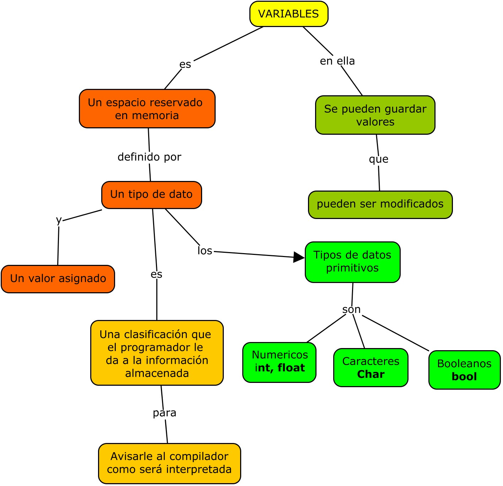
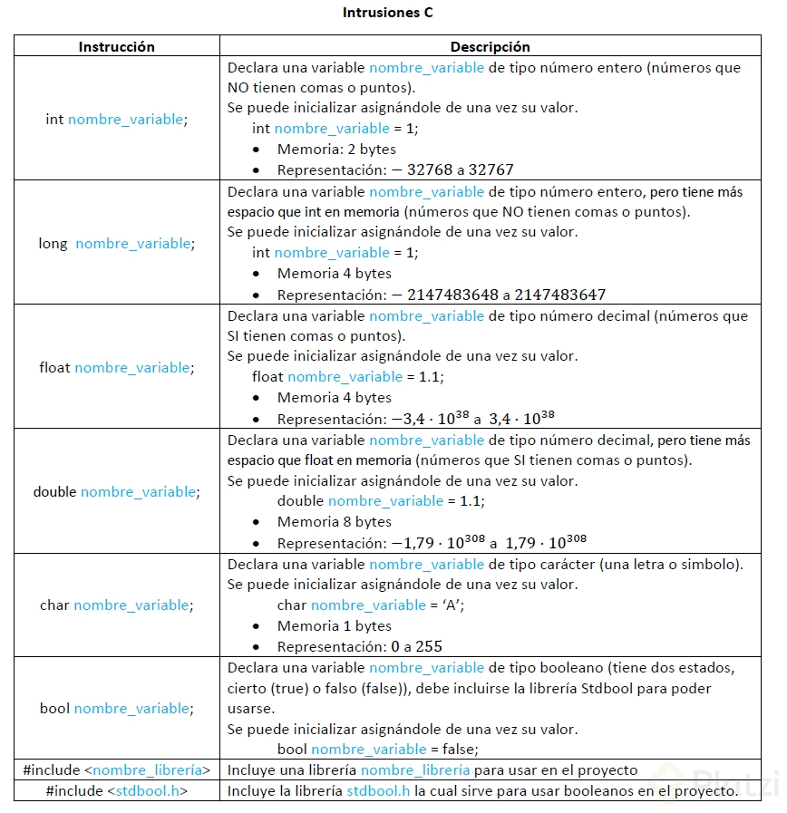
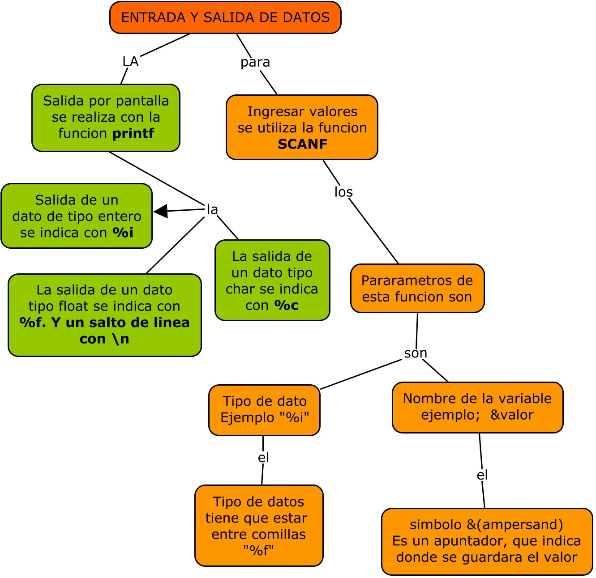
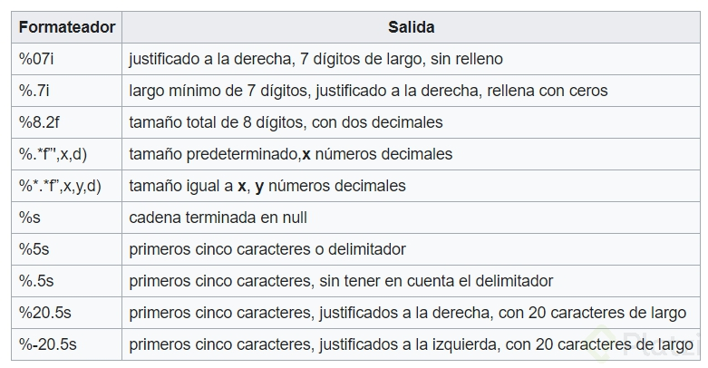

# Programación Estructurada

Es una técnica para escribir programas orientados a mejorar la claridad, calidad y tiempo de desarrollo de un programa de computadora recurriendo únicamente a subrutinas y tres estructuras básicas: secuencia, selección (if y switch) e iteracion (bucles for y while)

Las bases de la programación es:
* Resolver problemas
* Crear instrucciones
* Definir algoritmos

### ***Ventajas de la Programación Estructurada***

* Los programas son más fáciles de entender, pueden ser leídos de forma secuencial y no hay necesidad de hacer engorrosos seguimientos en saltos de líneas (GOTO) dentro de los bloques de código para intentar entender la lógica.
* La estructura de los programas es clara, puesto que las instrucciones están más ligadas o relacionadas entre sí.
* Reducción del esfuerzo en las pruebas y depuración. El seguimiento de los fallos o errores del programa (debugging) se facilita debido a su estructura más sencilla y comprensible, por lo que los errores se pueden detectar y corregir más fácilmente.
* Reducción de los costos de mantenimiento. Análogamente a la depuración, durante la fase de mantenimiento, modificar o extender los programas resulta más fácil.
* Los programas son más sencillos y más rápidos de confeccionar.
* Se incrementa el rendimiento de los programadores.

### ***Desventajas de la Programación Estructurada***
* Complejidad para adaptarse.
* Mayor cantidad de código (aunque a la larga no, por la reutilización).

Ocupamos un IDE (Entorno de desarrollo integrado) para escribir nuestro código.
***¿Qué es un compilador?***  
Es el encargado de traducir el lenguaje de programación que utilizamos al lenguaje maquina (lenguaje binario), es decir ceros y unos.   
***¿Qué hace un compilador?***  
como lo dice su nombre se encarga de compilar, en este caso compila nuestros programas transmitiendolos a la maquina para que nuestro programa funcione.  
***¿Qué es codeblocks?***   
es un IDE openSource que nos servirá para programar en C y compilar.   
***¿Qué es openSource?***  
Es algo que esta disponible para su modificación.  

***Generalmente, un IDE cuenta con las siguientes características:***   

* **Editor de código fuente:** editor de texto que ayuda a escribir el código de software con funciones como el resaltado de la sintaxis con indicaciones visuales, el relleno automático específico del lenguaje y la comprobación de errores a medida que se escribe el código.
* **Automatización de compilación local:** herramientas que automatizan tareas sencillas e iterativas como parte de la creación de una compilación local del software para su uso por parte del desarrollador, como la compilación del código fuente de la computadora en un código binario, el empaquetado del código binario y la ejecución de pruebas automatizadas.
* **Depurador:** programa que sirve para probar otros programas y mostrar la ubicación de un error en el código original de forma gráfica.

Un entorno de desarrollo integrado o entorno de desarrollo interactivo, en inglés Integrated Development Environment (IDE), es una aplicación informática que proporciona servicios integrales para facilitarle al desarrollador o programador el desarrollo de software.

Code :: Blocks es un IDE multiplataforma gratuito y de código abierto que admite múltiples compiladores, incluidos GCC, Clang y Visual C ++.

[Lenguaje de Programacion C](http://platea.pntic.mec.es/vgonzale/cyr_0204/cyr_01/control/lengua_C/)

Se desarrolla en C ++ usando wxWidgets como el kit de herramientas GUI.

[codebloks - Herramienta programacion en Multilenguaje](http://www.codeblocks.org/)   
[replit - Herramienta Web de programacion multilenguaje](https://replit.com)

## Etapas de desarrollo de un software
Cada nueva idea de un programa debe pasar por una serie de etapas de desarrollo. A nivel general son siempre 6: Análisis, Diseño, Desarrollo, Pruebas, Producción y Mantenimiento. Cada empresa o incluso cada desarrollador pueden tener una serie de sub-etapas y así mismo modificar las etapas generales para acomodarse a su estilo. Algunos desarrollos son denominados así porque necesita de algunos objetos nuevos, pero pueden ser mejoras o correcciones sobre otros proyectos.   
***Análisis***   
Es la primera de las etapas de desarrollo, corresponde a escuchar las peticiones para el sistema. Se planifica la forma de llevar las ideas a un software, acá no debe ser un impedimento el lenguaje de programación ni la infraestructura. Desde el consultor de sistemas se proponen mejoras que a veces el usuario ignora para mejorar el programa. Yo suelo utilizar prototipos para que el usuario tenga una vista previa y realice modificaciones antes de cualquier otra fase. Al final de esta fase se verifica si existe un ambiente de sistemas previamente instalado o si es un desarrollo totalmente nuevo. No olvidar incluir presupuesto de servidores, licencias, bases de datos entre lo más destacado.   
***Diseño***   
En esta fase es cuando se realiza toda la infraestructura que va a sostener el proyecto. Normalmente hablamos de objetos de base de datos, especialmente las tablas y las relaciones entre ellas. Se preparan todas las funcionalidades necesarias para suplir los requerimientos detectados en el análisis. Yo presento un segundo prototipo ya que el primero solo incluye funcionalidades, este muestra algo de diseño.  
El usuario siempre quiere incluir más cosas y se debe dejar en claro que esto influye en el tiempo y el costo del proyecto. Tras aprobar el prototipo se presenta la propuesta y se llega a un acuerdo. El problema principal está en calcular el tiempo para las etapas de de desarrollo, para esto es mejor dar un tiempo previsto pero que se pague sobre las funcionalidades. Si el proyecto es muy complejo es mejor realizarlo por etapas para evitar desbordar el tiempo y el costo de todo el programa.  
***Desarrollo***  
Es el momento del código es independiente del lenguaje de programación, de las metodologías, del estilo del programador, etc. Se pueden presentar mejoras u objeciones sobre el rendimiento del programa. Dentro de las etapas de desarrollo es la más delicada porque cada modificación puede cambiar toda la planificación. Esta fase tiene en si sub-fases a implementar: 
* análisis y diseño, 
* la codificación, 
* pruebas ingenieriles y 
* ajustes.   

El avance del software se suele presentar aquí sobre el número de funcionalidades totales sobre las completadas.  
***Desarrollo - Análisis y Diseño***   
A diferencia de las etapas de la idea el programador debe identificar procesos y funciones que se puedan reutilizar. Esto con la intención de llevarlas a una librería para el software. Así mismo dependiendo del lenguaje de programación puede calcular de forma previa el tiempo de desarrollo sobre los requerimientos.   
***Desarrollo - Codificación***   
La creación de librerías se termina haciendo de forma dinámica, y se modifica varias veces a medida que se necesita. Esto es así por lo menos en mi caso, pero puede ser que la persona que hizo el diseño, tenga mucha experiencia lo cual evitaría esta particularidad. Luego de eso se realizan los formularios, pantallas, reportes entre otras solicitudes. Estas últimas incluyen comunicación con otros programas así como interfaces entre otros.   
*** Desarrollo - Pruebas ingenieriles***   
Estas son las pruebas de cada funcionalidad en cada pantalla o reporte. **Se debe probar la creación, modificación, consulta y eliminación en cada caso.** Algunos ingenieros suelen automatizar este proceso, pero yo prefiero hacerlo por lo menos híbrido. Ya que en el camino se van presentando ajustes y pruebas sobre los mismos. Es preferible anotar todos los ajustes para adaptarlos después sino esta fase se podría alargar demasiado. Estas pruebas son diferentes a las pruebas principales ya que estas son realizadas por los programadores y las otras por usuarios que normalmente no saben de programación.   
***Desarrollo - Ajustes***   
Algunos incluyen esta fase con la anterior ya que apenas finaliza hay que realizar de nuevo las pruebas. Puede haber varios ciclos que retrasan los proyectos, pero es inevitable en algunos casos. Por otra parte si los programadores son muy novatos se presentan demasiados bugs (fallas del sistema). Entonces los equipos de desarrollo deberían tener una combinación entre novatos y experimentados para la totalidad de las etapas de desarrollo.  
***Pruebas***   
**Estas son pruebas realizadas por usuarios finales,** los cuales debe estar disponibles. Es recomendable tener varios usuarios ya que uno solo no encontraría todas las posibles fallas. Se puede presentar una lista de pruebas a realizar para evitar que se salten módulos o pantallas. De acá se genera una gran lista de bugs detectados que pasan a ajustarse en una serie de ciclos. Es muy importante dejar en claro que no se van a desarrollar nuevas funcionalidades.   
***Producción y mantenimiento***   
Los desarrollos se hacen en ambientes locales, es decir en las máquinas de los desarrolladores. En el análisis se debe dejar en claro que se necesita para que todo funcione correctamente. Muchas veces olvidamos la documentación del programa, este es el momento de realizarla. ¿Porque no antes? Bueno habría que modificar la documentación al tiempo con las pruebas. Ya deben estar disponibles los dominios, redes, servidores o hosting, etc. A partir de acá empieza a correr términos de garantías, como el soporte y estabilidad. Al finalizar el periodo de garantía es posible realizar una extensión sobre la misma. Pero es aún mejor ofrecer el servicio de soporte externo sobre la aplicación o un nuevo proyecto. Esta es la última de las etapas de desarrollo de un software para una sola versión.   

## Variables de datos (Asignación y clasificación)

***¿Qué es un tipo de dato?***   
Es una clasificación que el programador le da a la información almacenada para avisarle al compilador cómo va a ser interpretada.  
Un tipo de dato es, en esencia, un espacio en memoria con restricciones.

***Tipos de datos primitivos***
* **Numérico:** int (52, -999, 1853), float (3.1416, 0.0001)
* **Caracteres:** char (‘P’ ‘L’ ‘A’ ‘T’ ‘Z’ ‘I’)
* **Booleanos:** bool (Representa algo que puede ser verdadero <TRUE> o falso <FALSE>)

***¿Qué es una variable?***  
Es un espacio reservado en memoria, definido por un tipo de dato y un nombre asignado, en el cual se puede guardar un valor y se puede modificar.



```c
#include <stdio.h>

main()
}
// Declaración de una variable en C
    int healthpoints;

// Asignación de datos a una variable
    ealthpoints = 100;

//Iniciailización de una variable
	float damage = 13.05;
	char favoriteLetter = 'S';

	bool hasFun = false;

	return 0;
}
```



## Ingresar o Imprimir valores en programa



Se llama placeholder o marcador de posición, a una etiqueta que le dice al compilador que información debería aparecer en ese espacio. Son usados para presentar en pantalla el contenido de una variable (según su tipo de dato y formato deseado).



Adicionalmente, existe una propiedad de los placeholders llamada truncamiento, la cual permite definir la cantidad de digitos presentados

```c
#include <stdio>

int main(){

    int var1;
    long var2;
    float var3;
    double var4;
    char var5;

    printf("Ingresar el valor de variable de tipo entero : ");
    scanf("%i", &var1);

    printf("Ingresar el valor de variable de tipo long: ");
    scanf("%l", &var2);

    printf("Ingresar el valor de variable de tipo float: ");
    scanf("%f", &var3);

    printf("Ingresar el valor de variable de tipo double: ");
    scanf("%f", &var4);

    printf("Ingresar el valor de variable de tipo char: ");
    scanf("%c", &var5);

    printf("Imprimiendo variables asignadas > \n");
    printf("Valor de var1 => %i \n",var1);
    printf("Valor de var2 => %i \n",var2);
    printf("Valor de var3 => %8.2f \n",var3);
    printf("Valor de var4 => %d \n",var4);
    printf("Valor de var5 => %c \n",var5);


    return 0;
}


```